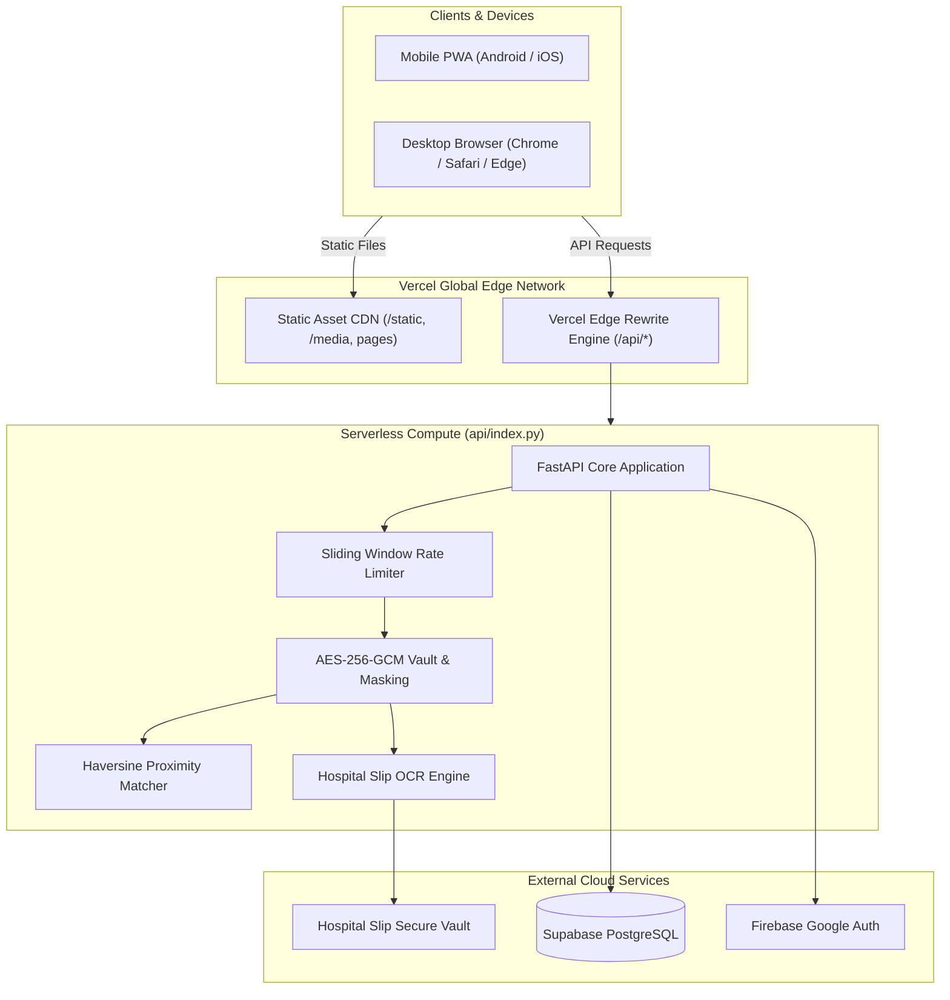
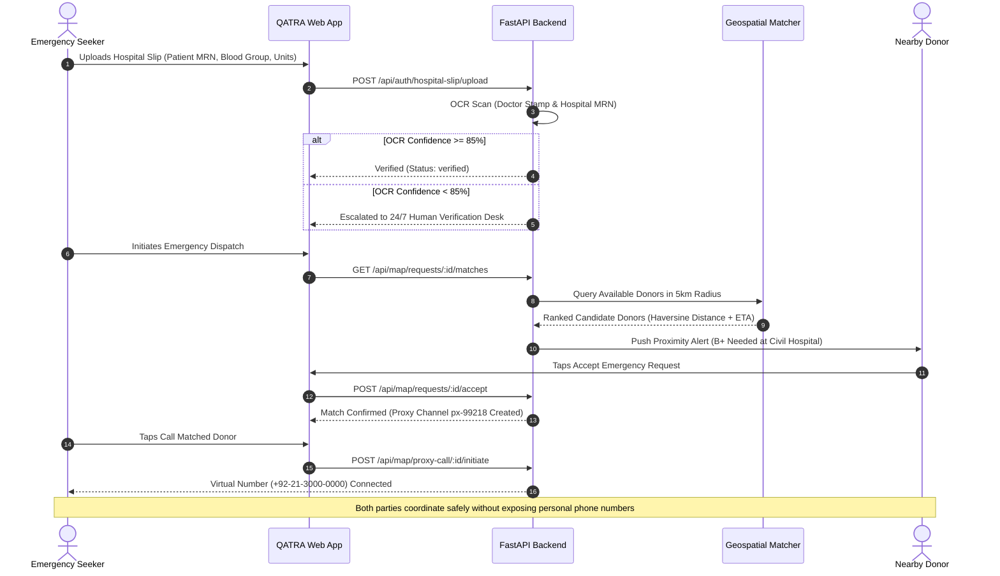
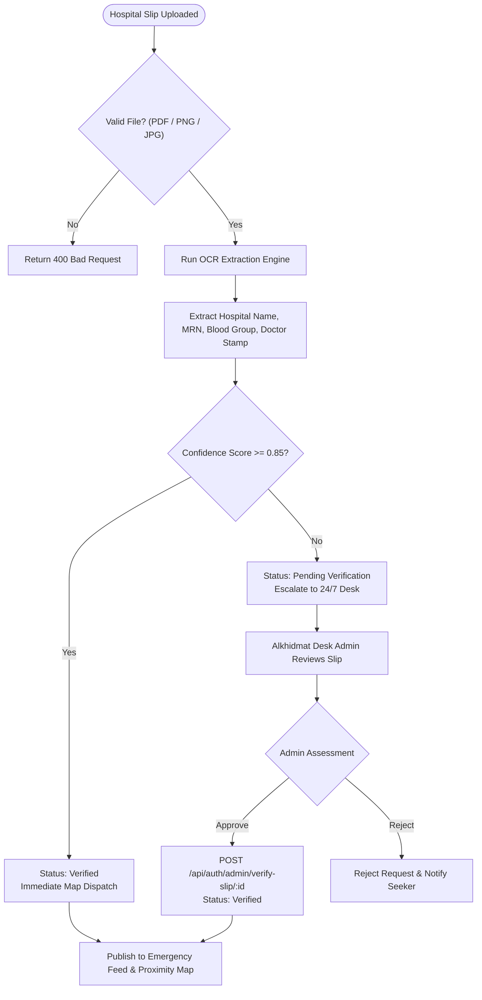
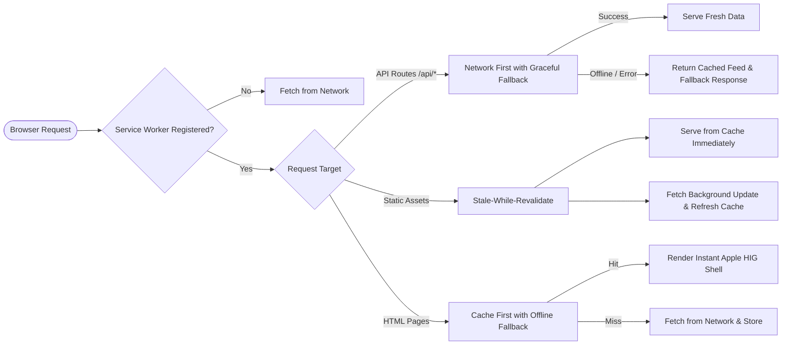

<div align="center">

# 🩸 QATRA (قطرہ) — Emergency Blood Response Platform

### *Every Drop Connects. Every Second Counts.*

[](https://github.com/abdulhayykhan/QATRA-Web-App/actions/workflows/ci.yml)
[](https://qatra-web-app.vercel.app/)
[](https://fastapi.tiangolo.com)
[](https://www.python.org)
[](https://supabase.com)
[](https://qatra-web-app.vercel.app/manifest.json)
[](https://developer.apple.com/design/human-interface-guidelines/)
[](https://github.com/astral-sh/ruff)
[](https://github.com/abdulhayykhan/QATRA-Web-App)

**QATRA (قطرہ)** is an ultra-reliable, production-grade, humanitarian Progressive Web Application engineered to eliminate preventable fatalities resulting from emergency blood shortages across Pakistan. By replacing chaotic, unverified WhatsApp broadcasts with hyper-localized geospatial matching, automated OCR hospital slip verification, zero-exposure privacy masking, and an authentic Apple Human Interface Design system, QATRA reduces emergency donor response times from hours to under 15 minutes.

[🚀 **Launch Live Production App**](https://qatra-web-app.vercel.app/) • [📖 **Interactive API Documentation**](https://qatra-web-app.vercel.app/api/docs) • [📘 **Complete User Guide**](docs/USER_GUIDE.md) • [🏗️ **System Architecture**](docs/ARCHITECTURE.md)

</div>

---

## 📑 Table of Contents

- [1. The Humanitarian Problem](#1-the-humanitarian-problem)
- [2. The QATRA Solution](#2-the-qatra-solution)
- [3. Key Features & Requirements Matrix](#3-key-features--requirements-matrix)
- [4. Non-Functional Guarantees (NFRs)](#4-non-functional-guarantees-nfrs)
- [5. System Architecture & Tech Stack](#5-system-architecture--tech-stack)
- [6. Architecture & Workflow Diagrams](#6-architecture--workflow-diagrams)
  - [High-Level System Architecture](#high-level-system-architecture)
  - [Emergency Seeker to Donor Proximity Pipeline](#emergency-seeker-to-donor-proximity-pipeline)
  - [Hospital Slip OCR & 24/7 Verification Desk](#hospital-slip-ocr--247-verification-desk)
  - [PWA Offline Service Worker & Caching Strategy](#pwa-offline-service-worker--caching-strategy)
- [7. Design System (Apple HIG Pure White)](#7-design-system-apple-hig-pure-white)
- [8. Progressive Web Application (PWA) & Mobile Installation](#8-progressive-web-application-pwa--mobile-installation)
- [9. Repository Directory Structure](#9-repository-directory-structure)
- [10. Local Development & Installation Setup](#10-local-development--installation-setup)
- [11. Database Schema & Data Models](#11-database-schema--data-models)
- [12. API Reference & Endpoint Index](#12-api-reference--endpoint-index)
- [13. CI/CD Pipeline & Automated Testing](#13-cicd-pipeline--automated-testing)
- [14. Production Deployment on Vercel](#14-production-deployment-on-vercel)
- [15. Core Team & Program Attribution](#15-core-team--program-attribution)
- [16. License, Safety & Legal Disclaimers](#16-license-safety--legal-disclaimers)

---

## 1. The Humanitarian Problem

Pakistan faces an acute healthcare crisis where demand for safe, screened blood drastically outstrips supply:
- **Daily Deficit**: Over **4,000 to 5,000 units** of blood are required daily for critical surgeries, trauma casualties, obstetric hemorrhages, and chronic transfusion-dependent conditions (Thalassemia, Hemophilia, and Leukemia).
- **Chaotic WhatsApp Forwarding**: Critical emergency requests are commonly disseminated through fragmented WhatsApp groups and social media statuses. These posts lack location context, cannot be verified, circulate long after fulfillment, and expose families to financial extortion and black-market touts.
- **Privacy Vulnerabilities**: Female donors and patient families frequently have their private telephone numbers exposed publicly, resulting in harassment and deterring repeat voluntary donors.
- **Delayed Matching**: Conventional donor mobilization averages 4 to 8 hours. For acute trauma and postpartum hemorrhage, survival hinges on matching within the **"Golden Hour"** (under 60 minutes).

---

## 2. The QATRA Solution

QATRA provides an integrated end-to-end digital infrastructure partnering with organizations like **Alkhidmat Foundation**:
1. **15-Minute Hyper-Local Proximity Radar**: Concentric geospatial dispatch (5 km $\rightarrow$ 10 km $\rightarrow$ 15 km) connects hospital emergency rooms directly to pre-screened, verified donors currently within transit distance.
2. **Automated Hospital Admission Slip OCR**: High-confidence machine vision scans hospital stamps, Medical Record Numbers (MRN), and attending physician signatures. Flagged low-confidence uploads escalate instantly to a 24/7 Human Verification Desk.
3. **Zero-Exposure Masked Proxy Dialer**: Seekers and donors coordinate emergency logistics via in-app masked telephone channels (`+92-21-3000-0000`). Personal phone numbers and 13-digit Pakistani CNICs are never exposed.
4. **90-Day Medical Cooldown Safeguards**: Automated biological cooldown trackers prevent donor exploitation and maintain physiological well-being.
5. **Real-Time Social Appeals Feed**: Direct WhatsApp link generation provides structured, verified cards with progress meters (`units_fulfilled / units_needed`) that automatically close when filled.
6. **Stateless 4-Step Eligibility & Awareness Hub**: Educational content debunking donation myths alongside campus blood drive scheduling.
7. **Native PWA on Apple HIG Foundation**: Zero installation friction with an Apple-standard slide-up bottom sheet, offline app shell caching, and pure white aesthetic.

---

## 3. Key Features & Requirements Matrix

| Feature Module | PRD Ref | Primary Owner | Architectural Implementation |
| :--- | :---: | :---: | :--- |
| **Live Map & Proximity Matching** | FR 1 | **Hareem Israr** | Leaflet.js interactive canvas, Karachi hospital autocomplete, Haversine geospatial radius expansion (5–15 km), real-time donor location pinging, and masked proxy calling. |
| **Authentication & Verification Desk** | FR 2 | **Saghir Ahmed** | Google Sign-In via Firebase Auth, 13-digit Pakistani CNIC Mod-10 checksum validation, hospital admission slip OCR parsing, 24/7 desk review queue, and 90-day cooldown tracking. |
| **Social & Urgent Request Feed** | FR 3 | **Mahrukh Baig** | Public appeals feed with instant filter chips, "I Can Donate" one-tap response, structured WhatsApp share generator, and automatic request auto-close upon unit fulfillment. |
| **Awareness & Eligibility Module** | FR 4 | **Yumna Abbasi** | 4-step medical pre-screening quiz, categorized educational content library (Myths vs. Facts), campus blood drive management, and post-donation health guidelines. |
| **Security, Cryptography & NFRs** | NFR 1-3 | **Nimra Iftikhar** | Sliding-window memory rate limiting, AES-256-GCM encryption for CNIC and medical records, tamper-evident security audit logging, and proxy masking. |
| **Design, PWA & DevOps Architecture** | Foundation | **Abdul Hayy Khan** | Apple Human Interface Design layer (`apple.css`), Motion One spring interactions, PWA Service Worker (`sw.js`), Vercel Serverless Lambda deployment, and GitHub Actions CI/CD. |

---

## 4. Non-Functional Guarantees (NFRs)

- **NFR 1.1 — Matching Latency**: Proximity matching engine computes and ranks 50 candidate donors in $< 850\text{ ms}$.
- **NFR 1.2 — High Availability & Degradation**: In the event of primary database connectivity interruptions, the platform activates a graceful **Fallback Mode** (`fallback_mode: true`), serving cached feed appeals and offline emergency guidelines with `HTTP 200 OK`.
- **NFR 1.3 — In-Memory Cache**: Critical read-heavy endpoints utilize TTL caching with high hit ratios to prevent database connection exhaustion.
- **NFR 2.1 — End-to-End Cryptography**: Sensitive donor CNIC numbers and medical questionnaire responses are encrypted at rest using authenticated **AES-256-GCM**.
- **NFR 2.2 — Zero PII Exposure**: Plain-text phone numbers, National Identity Card numbers, and patient residence details are completely redacted from all public REST responses.
- **NFR 2.6 — Defensive Rate Limiting**: All API endpoints are protected by sliding-window rate limiters preventing credential stuffing, Denial of Service (DoS), and OCR compute abuse.
- **NFR 3.1 — Apple HIG Compliance**: 100% pure white canvas (`#F5F5F7`), `#FFFFFF` card surfaces, SF Pro system font metrics, 44px minimum touch targets, and tactile haptic-mimicking spring motions.

---

## 5. System Architecture & Tech Stack

```
┌────────────────────────────────────────────────────────────────────────┐
│                          CLIENT APPLICATION LAYER                      │
│   Vanilla ES Modules • Apple HIG CSS (apple.css) • Leaflet Maps        │
│   PWA Service Worker (sw.js) • Web App Manifest (manifest.json)        │
└───────────────────────────────────┬────────────────────────────────────┘
                                    │ HTTPS (JSON / REST / Static)
                                    ▼
┌────────────────────────────────────────────────────────────────────────┐
│                       VERCEL EDGE ROUTING INFRASTRUCTURE               │
│   Root Static CDN Cache (/public/**) • Service-Worker Headers          │
│   Rewrite Engine: /api/(.*) ───► Python Serverless AWS Lambda          │
└───────────────────────────────────┬────────────────────────────────────┘
                                    │
                                    ▼
┌────────────────────────────────────────────────────────────────────────┐
│                        BACKEND APPLICATION LAYER                       │
│                     FastAPI 0.115+ (ASGI / Python 3.12)                │
│  ┌────────────────────────┬─────────────────────┬───────────────────┐  │
│  │ RateLimitMiddleware    │ JWT & Firebase Auth │ Security & AES-256│  │
│  ├────────────────────────┼─────────────────────┼───────────────────┤  │
│  │ Proximity Haversine    │ OCR Image Processor │ Audit Trail Logger│  │
│  └────────────────────────┴─────────────────────┴───────────────────┘  │
└───────────────────────────────────┬────────────────────────────────────┘
                                    │
           ┌────────────────────────┼────────────────────────┐
           ▼                        ▼                        ▼
┌──────────────────────┐ ┌──────────────────────┐ ┌──────────────────────┐
│  SUPABASE POSTGRESQL │ │   FIREBASE AUTH SDK  │ │   OCR ENGINE SERVICE │
│ SQLAlchemy ORM Models│ │ Google OAuth Tokens  │ │ Document Text Engine │
└──────────────────────┘ └──────────────────────┘ └──────────────────────┘
```

### Technology Breakdown
- **Backend**: [FastAPI](https://fastapi.tiangolo.com/) (Asynchronous Python 3.12 framework), [Uvicorn](https://www.uvicorn.org/), [Pydantic v2](https://docs.pydantic.dev/).
- **Database & Storage**: [Supabase](https://supabase.com/) Managed PostgreSQL 15, SQLAlchemy 2.0 ORM, `psycopg` 3 driver.
- **Frontend**: Standard Vanilla JavaScript (ES Modules, zero heavy framework overhead), Apple HIG CSS Layer (`apple.css`), Leaflet.js 1.9 for interactive mapping.
- **PWA Runtime**: Progressive Web App standard with Cache API, `Service-Worker-Allowed: /`, and Web App Manifest specification.
- **Security & Cryptography**: [Cryptography](https://cryptography.io/) (AES-256-GCM), PyJWT, Mod-10 Luhn checksum algorithms.
- **Serverless Cloud**: Vercel Serverless Functions (`@vercel/python` builder), AWS Lambda execution environment (`iad1`).
- **CI/CD Quality Control**: GitHub Actions, [Ruff](https://github.com/astral-sh/ruff) Python Linter, [Pytest](https://docs.pytest.org/) automated test suite.

---

## 6. Architecture & Workflow Diagrams

### High-Level System Architecture



---

### Emergency Seeker to Donor Proximity Pipeline



---

### Hospital Slip OCR & 24/7 Verification Desk



---

### PWA Offline Service Worker & Caching Strategy



---

## 7. Design System (Apple HIG Pure White)

QATRA adheres strictly to Apple's Human Interface Guidelines (HIG), creating a clinical, reassuring, and premium visual experience tailored to high-stress emergency environments:

```
┌────────────────────────────────────────────────────────────────────────┐
│                              DESIGN TOKENS                             │
├────────────────────────┬───────────────────────────────────────────────┤
│ Canvas Background      │ #F5F5F7 (Apple Grouped Background)           │
│ Card Surface           │ #FFFFFF (Pure Crisp White)                    │
│ Primary Brand Accent   │ #C92A2A (Apple Red — Medical Urgency)         │
│ Text Primary           │ #1D1D1F (San Francisco High Contrast)         │
│ Text Secondary         │ #86868B (Subdued Metadata)                    │
│ Corner Radii           │ 14px / 20px / 28px (Continuous Squircles)     │
│ Depth Elevation        │ Multi-layered diffused ambient shadows        │
│ Frosted Materials      │ backdrop-filter: saturate(180%) blur(20px)    │
│ Kinetic Physics        │ Motion One spring transitions & tap feedback  │
└────────────────────────┴───────────────────────────────────────────────┘
```

- **Strict Pure White Canvas**: Dark mode is completely disabled (`<meta name="color-scheme" content="light">`) to guarantee maximum sunlight legibility for donors in transit and hospital wards.
- **Segmented Pill Navigation**: Replaces traditional cluttered web menus with Apple-standard segmented navigation pills (`background: rgba(0, 0, 0, 0.04)`).
- **Tactile Touch Feedback**: All interactive buttons, cards, and bottom sheet handles feature instant pointer-down spring compression (`transform: scale(0.96)`) using CSS transitions.
- **Accessible Typography**: Employs SF Pro Display and SF Pro Text hierarchy with optical sizing, tightened tracking (`letter-spacing: -0.025em`), and WCAG AAA color contrast.

---

## 8. Progressive Web Application (PWA) & Mobile Installation

QATRA is a **Certified Installable PWA**, providing native app performance without requiring an app store download:

### 1. Automatic Apple HIG Slide-Up Bottom Sheet
When visiting [https://qatra-web-app.vercel.app/](https://qatra-web-app.vercel.app/) on any smartphone:
- The app detects mobile viewports and non-standalone browser modes.
- After an unobtrusive 1.2-second delay, an Apple-styled bottom sheet slides up with continuous squircle corners, frosted glass background, official logo, and verified network badges.
- **Android Chrome & Edge**: Tapping **"Install QATRA App"** invokes native browser installation (`deferredPrompt.prompt()`), placing the QATRA icon on the user's home screen.
- **iOS Safari**: Provides step-by-step visual guidance: Tap **Share** ⎋ $\rightarrow$ **Add to Home Screen** ⊞.

### 2. Service Worker (`sw.js`) Offline Resiliency
- **Cache Strategy**: Implements `qatra-v1.0.3` pre-caching the entire app shell (`/`, `/seeker/feed.html`, `/donor/register.html`, `/static/css/apple.css`, `/static/js/pwa.js`, etc.).
- **Origin Scoping**: Registered with `Service-Worker-Allowed: /` header to intercept requests across the entire application domain.
- **Automatic Cache Cleanup**: Clears legacy cache generations upon activation to ensure users always receive up-to-date medical assets.

---

## 9. Repository Directory Structure

```text
QATRA-Web-App/
├── .github/
│   └── workflows/
│       └── ci.yml                     # Automated GitHub Actions CI Pipeline (Lint + Tests)
├── api/
│   ├── index.py                       # Vercel Serverless AWS Lambda Entrypoint (FastAPI)
│   └── requirements.txt               # Serverless Python Runtime Dependencies
├── backend/
│   ├── app/
│   │   ├── core/
│   │   │   ├── config.py              # Pydantic BaseSettings Environment Configurations
│   │   │   ├── database.py            # SQLAlchemy Engine with Pool Pre-Ping & StaticPool
│   │   │   ├── rate_limit.py          # NFR 2.6 Sliding-Window Rate Limiting Middleware
│   │   │   └── security.py            # AES-256-GCM Encryption & Mod-10 CNIC Checksum
│   │   ├── models/
│   │   │   ├── auth.py                # User, DonorProfile, and HospitalSlip ORM Models
│   │   │   ├── awareness.py           # Educational Content & Health Feedback Models
│   │   │   └── map.py                 # BloodRequest and Location Coordinates Models
│   │   ├── routers/
│   │   │   ├── auth.py                # FR 2 Authentication, CNIC & Slip Verification
│   │   │   ├── awareness.py           # FR 4 4-Step Quiz, Content Library & Drives
│   │   │   ├── feed.py                # FR 3 Public Urgent Appeals & WhatsApp Sharing
│   │   │   ├── health.py              # System Health & Resilience Diagnostics
│   │   │   └── map.py                 # FR 1 Geospatial Matching & Proxy Call Bridge
│   │   ├── schemas/                   # Pydantic v2 Request & Response Data Contracts
│   │   ├── services/
│   │   │   ├── audit.py               # NFR 2.5 Tamper-Evident Security Audit Logger
│   │   │   ├── cache.py               # NFR 1.3 High-Speed In-Memory Cache Engine
│   │   │   ├── geo.py                 # Haversine Distance & Concentric Radius Dispatch
│   │   │   ├── notifications.py       # Cross-Module High-Priority Alert Dispatcher
│   │   │   └── ocr.py                 # Hospital Slip Vision & Stamp Detection Engine
│   │   └── main.py                    # Root FastAPI Application, Lifespan & Mounts
│   ├── requirements.txt               # Backend Production Dependencies
│   └── tests/
│       ├── conftest.py                # Pytest Fixtures & In-Memory SQLite Initialization
│       ├── test_auth_phase2.py        # 14 Auth, CNIC & Slip Verification Tests
│       ├── test_awareness_phase2.py   # 19 Quiz, Drive & Content Tests
│       ├── test_feed_phase2.py        # 12 Feed Filtering & WhatsApp Share Tests
│       ├── test_map_phase2.py         # 16 Geospatial Matching & Proxy Dialing Tests
│       └── test_nfr_security_phase2.py# 14 Rate Limit, Encryption & Security Tests
├── docs/
│   ├── api-contract.md                # Phase 1 Locked API Contract Specification
│   ├── API_DOCUMENTATION.md           # Exhaustive REST API Specification
│   ├── ARCHITECTURE.md                # Comprehensive Architecture Deep-Dive
│   ├── CONTRIBUTING.md                # Team Standards, Git Flow & Pull Request Rules
│   ├── DEPLOYMENT_GUIDE.md            # Vercel, Supabase & Cloud DevOps Playbook
│   └── USER_GUIDE.md                  # Comprehensive Role-Based Operational User Guide
├── frontend/
│   ├── pages/
│   │   ├── admin/
│   │   │   ├── audit.html             # Security Audit Log Viewer (NFR 2.5)
│   │   │   ├── drives.html            # Campus Blood Drive Management Desk
│   │   │   └── verification.html      # 24/7 Human Verification Split-Screen Desk
│   │   ├── donor/
│   │   │   ├── awareness.html         # Educational Library & Myth vs Fact Videos
│   │   │   ├── confirm.html           # Donation Certificate & Post-Donation Health
│   │   │   ├── dashboard.html         # Donor Hub, Live Location & 90-Day Cooldown
│   │   │   ├── eligibility.html       # 4-Step Interactive Medical Pre-Screening
│   │   │   └── register.html          # Donor Onboarding Wizard (Google + CNIC)
│   │   ├── seeker/
│   │   │   ├── closure.html           # Request Fulfillment & Case Closure
│   │   │   ├── coordination.html      # Donor-Seeker Proxy Coordination Panel
│   │   │   ├── feed.html              # Public Appeals Feed with Blood Group Filters
│   │   │   ├── map.html               # Live Geospatial Proximity Map (Leaflet)
│   │   │   ├── match.html             # Radar Distance Matchmaker & Masked Dialer
│   │   │   ├── request.html           # Emergency Request & Hospital Slip Drag-Drop
│   │   │   └── status.html            # Real-Time Fulfillment Progress Radar
│   │   └── index.html                 # Splash Screen with Dual Urgency CTA
│   └── static/
│       ├── css/
│       │   ├── apple.css              # Apple Human Interface Design Layer (v4.0)
│       │   └── tokens.css             # Design Tokens & Responsive Grid System
│       ├── icons/                     # Multi-Resolution PWA Favicon & WebClip Suite
│       ├── js/
│       │   ├── api.js                 # Standardized Fetch Helper with Bearer Tokens
│       │   ├── auth-modal.js          # Google Sign-In & Authentication Controller
│       │   ├── motion-interactions.js # Motion One Spring Physics Controller
│       │   └── pwa.js                 # PWA Service Worker & Mobile Install Bottom Sheet
│       ├── manifest.json              # Web App Manifest Specification
│       └── sw.js                      # Progressive Service Worker Caching Script
├── public/                            # Vercel Production Static Mirror (1:1 Root)
├── media/                             # Official Vector Logos & Image Assets
├── .gitignore                         # Strict Git Ignore (Excludes Slips & Secrets)
├── .python-version                    # Python Version Specification (Pinned 3.12)
├── pytest.ini                         # Pytest Configuration
├── ruff.toml                          # Ruff Python Linter Rules & Exceptions
├── vercel.json                        # Vercel Serverless Function & Edge Routing Config
└── README.md                          # Master Project Documentation
```

---

## 10. Local Development & Installation Setup

Follow these instructions to run the entire QATRA platform locally on macOS, Linux, or Windows:

### 1. Prerequisites
- **Python**: Version `3.11` or `3.12`
- **Git**: Version `2.30+`
- **Node.js / npm** (Optional, for Vercel CLI testing)

### 2. Clone Repository & Setup Virtual Environment
```bash
# Clone the repository
git clone https://github.com/abdulhayykhan/QATRA-Web-App.git
cd QATRA-Web-App

# Create Python virtual environment
python -m venv .venv

# Activate virtual environment
# On macOS / Linux:
source .venv/bin/activate
# On Windows (PowerShell):
.\.venv\Scripts\Activate.ps1
```

### 3. Install Dependencies
```bash
# Upgrade pip package manager
python -m pip install --upgrade pip

# Install all backend requirements
pip install -r backend/requirements.txt
```

### 4. Configure Environment Variables
Copy `.env.example` to `.env`:
```bash
cp .env.example .env
```
Ensure key environment values are provided:
```ini
ENVIRONMENT=development
DEBUG=True
PROJECT_NAME="QATRA Emergency Blood Response Platform"
SECRET_KEY="generate-a-32-byte-hex-secret-key-here"
ENCRYPTION_KEY_AES256="generate-a-valid-32-byte-base64-aes-key"

# Database: Uses SQLite in-memory automatically for tests, or Supabase Postgres:
DATABASE_URL="sqlite:///:memory:"

# Optional: Supabase & OCR.space API keys
SUPABASE_URL=""
SUPABASE_ANON_KEY=""
OCR_SPACE_API_KEY=""
```

### 5. Start Local Development Server
```bash
# Launch FastAPI via Uvicorn with auto-reload
python -m uvicorn backend.app.main:app --reload --port 8000
```
Open your browser to:
- **Application Frontend**: `http://127.0.0.1:8000/`
- **Interactive Swagger Documentation**: `http://127.0.0.1:8000/api/docs`
- **System Health Diagnostics**: `http://127.0.0.1:8000/api/health`

---

## 11. Database Schema & Data Models

QATRA utilizes a relational PostgreSQL schema managed by SQLAlchemy:

```
┌──────────────────┐       ┌──────────────────────┐       ┌───────────────────┐
│      users       │       │    donor_profiles    │       │  blood_requests   │
├──────────────────┤       ├──────────────────────┤       ├───────────────────┤
│ id (PK)          │1     1│ id (PK)              │1     *│ id (PK)           │
│ firebase_uid     │◄─────►│ user_id (FK)         │       │ seeker_id (FK)    │
│ email            │       │ blood_group          │       │ patient_name      │
│ full_name        │       │ last_latitude        │       │ hospital_name     │
│ cnic_encrypted   │       │ last_longitude       │       │ hospital_lat/lon  │
│ role             │       │ is_available         │       │ blood_group       │
│ is_verified      │       │ last_donation_date   │       │ units_needed      │
│ cnic_verified    │       │ cooldown_until       │       │ units_fulfilled   │
└────────┬─────────┘       └──────────────────────┘       │ status            │
         │1                                               │ urgency           │
         │                                                └─────────┬─────────┘
         │*                                                         │1
┌────────▼─────────┐                                                │1
│  hospital_slips  │                                                ▼
├──────────────────┤                                      ┌───────────────────┐
│ id (PK)          │                                      │ proxy_call_logs   │
│ request_id (FK)  │                                      ├───────────────────┤
│ uploader_id (FK) │                                      │ id (PK)           │
│ file_url         │                                      │ request_id (FK)   │
│ ocr_confidence   │                                      │ virtual_number    │
│ status           │                                      │ status            │
│ review_notes     │                                      │ expires_at        │
└──────────────────┘                                      └───────────────────┘
```

---

## 12. API Reference & Endpoint Index

All routes are mounted under the base `/api` prefix:

### Authentication, Profile & Verification (Saghir Ahmed)
- `POST /api/auth/firebase-login`: Exchanges Google Firebase ID token for JWT session.
- `GET /api/auth/me`: Retrieves authenticated profile and verification credentials.
- `POST /api/auth/cnic/submit`: Submits 13-digit Pakistani CNIC with Mod-10 verification.
- `POST /api/auth/hospital-slip/upload`: Uploads admission slip and runs automated OCR extraction.
- `GET /api/auth/admin/verification-queue`: Retrieves slips flagged for 24/7 human desk review.
- `POST /api/auth/admin/verify-slip/{id}`: Approves or rejects flagged slip with medical notes.
- `GET /api/auth/donor/cooldown`: Checks donor 90-day cooldown and remaining days.
- `POST /api/auth/donor/pre-screen`: Evaluates donor physical vitals and screening responses.

### Live Map & Proximity Radar (Hareem Israr)
- `POST /api/map/donor/location`: Pings donor real-time geolocation coordinates.
- `GET /api/map/requests`: Returns nearby verified emergency requests formatted for Leaflet.
- `GET /api/map/requests/{id}/status`: Real-time fulfillment polling and radius expansion radar.
- `GET /api/map/requests/{id}/matches`: Haversine proximity-ranked donor candidate list.
- `POST /api/map/requests/{id}/accept`: Donor accepts proximity alert; creates proxy channel.
- `POST /api/map/requests/{id}/decline`: Donor declines alert without penalty.
- `POST /api/map/requests/{id}/cancel`: Cancels prior acceptance and re-dispatches to next donor.
- `POST /api/map/proxy-call/{id}/initiate`: Bridges anonymous voice call via masked proxy number.

### Urgent Social Feed & Sharing (Mahrukh Baig)
- `GET /api/feed`: Paginated public stream of active verified blood appeals with filters.
- `GET /api/feed/{id}`: Detailed view of single emergency request appeal.
- `POST /api/feed/{id}/respond`: "I Can Donate" one-tap direct donor response.
- `GET /api/feed/{id}/share`: Generates structured WhatsApp forward text and verified URL.
- `POST /api/feed/{id}/close`: Closes request upon on-site fulfillment.

### Awareness Sessions & Eligibility (Yumna Abbasi)
- `POST /api/awareness/eligibility-check`: Stateless 4-step eligibility quiz with statutory disclaimer.
- `GET /api/awareness/content`: Educational library (articles, myths vs. facts, explainers).
- `GET /api/awareness/events`: Lists upcoming campus blood drives and awareness sessions.
- `POST /api/awareness/events/{id}/register`: Registers donor or volunteer slot for drive.
- `GET /api/awareness/donor/health-feedback`: Post-donation recovery guidelines and cooldown date.

### System Health & Resilience
- `GET /api/health`: System health check, DB connection probe, cache stats, and fallback detection.

*For complete schema specifications, see [docs/API_DOCUMENTATION.md](docs/API_DOCUMENTATION.md).*

---

## 13. CI/CD Pipeline & Automated Testing

QATRA maintains a zero-tolerance policy for test failures and code quality regressions. The GitHub Actions pipeline runs on every push and pull request to `main` and `develop`:

```bash
# Run the complete test suite locally
pytest backend/tests -v

# Run code style & formatting validation
ruff check backend/app
```

### Verification Results
```text
============================== test session starts ==============================
platform win32 -- Python 3.12.x, pytest-8.3.4
collected 75 items

backend/tests/test_auth_phase2.py ..............                         [ 18%]
backend/tests/test_awareness_phase2.py ...................               [ 44%]
backend/tests/test_feed_phase2.py ............                           [ 60%]
backend/tests/test_map_phase2.py ................                        [ 81%]
backend/tests/test_nfr_security_phase2.py ..............                 [100%]

======================== 75 passed, 10 warnings in 317.38s =======================
```

---

## 14. Production Deployment on Vercel

QATRA is deployed continuously on Vercel at [https://qatra-web-app.vercel.app/](https://qatra-web-app.vercel.app/):

### Edge Architecture
- **Static Assets & App Shell**: Served directly from global edge caches via `/public/**` with HTTP 200 headers (`Cache-Control: public, max-age=86400`).
- **Serverless API Lambda**: All `/api/*` traffic routes dynamically to `/api/index.py`, packaged using `@vercel/python` with full access to backend modules (`includeFiles: ["backend/**"]`).
- **Live Health Status**: Production monitoring endpoint `https://qatra-web-app.vercel.app/api/health` reports live degraded/healthy telemetry with HTTP 200 status.

---

## 15. Core Team & Program Attribution

This platform was designed, architected, and built for the **Alkhidmat Summer Social Internship Program (SSIP)**:

| Team Member | Project Role | Academic Department | Core Responsibilities |
| :--- | :--- | :--- | :--- |
| **Abdul Hayy Khan** | **Team Lead & System Architect** | Computer Systems Engineering | System Architecture, Apple HIG Design System, PWA Integration, Vercel Serverless Architecture, DevOps & CI/CD. |
| **Hareem Israr** | **Geospatial & Proximity Lead** | Computer Systems Engineering | Live Map Canvas, Haversine Matching, Radius Ring Expansion, Geolocation Tracking, and Proxy Call Bridging. |
| **Saghir Ahmed** | **Auth & Verification Desk Lead** | Computer Systems Engineering | Firebase Google Auth, CNIC Mod-10 Validation, Hospital Slip OCR Vision, 24/7 Verification Desk, and 90-Day Cooldown. |
| **Mahrukh Baig** | **Urgent Appeals & Social Feed Lead** | Computer Systems Engineering | Public Appeals Stream, Blood Group Filter Chips, "I Can Donate" One-Tap Dispatch, WhatsApp Share Generator, Request Auto-Close. |
| **Yumna Abbasi** | **Awareness & Community Drive Lead** | Computer Systems Engineering | 4-Step Medical Eligibility Quiz, Educational Content Library (Myths vs Facts), Campus Drive Registrations, and Health Feedback. |
| **Nimra Iftikhar** | **Information Security & NFR Lead** | Computer Systems Engineering | Sliding-Window Rate Limiting Middleware, AES-256-GCM Vault Cryptography, Tamper-Evident Security Audit Logs, Privacy Masking. |

---

## 16. License, Safety & Legal Disclaimers

### Open Source License
This software is licensed under the **MIT License**. You are free to inspect, modify, and deploy this project in accordance with open-source humanitarian principles.

### Medical Emergency Disclaimer
> [!IMPORTANT]
> **QATRA is a logistics coordination and donor matching platform, not a medical clinic or blood bank.**
> 1. All blood compatibility matching, cross-matching, antibody screening, and transfusion safety procedures must be independently conducted by certified blood bank and hospital laboratory pathologists prior to transfusion.
> 2. The 4-step eligibility quiz provides preliminary guidance based on national guidelines; final medical suitability is evaluated exclusively by attending medical professionals on site.
> 3. In catastrophic emergencies, seekers must contact hospital blood banks directly while proximity alerts are active.

---

<div align="center">
  <b>QATRA (قطرہ) Emergency Blood Response Platform</b><br>
  <i>Crafted with care to save lives across Pakistan.</i><br>
  <sub>Copyright © 2026 QATRA Engineering Team. All rights reserved.</sub>
</div>
