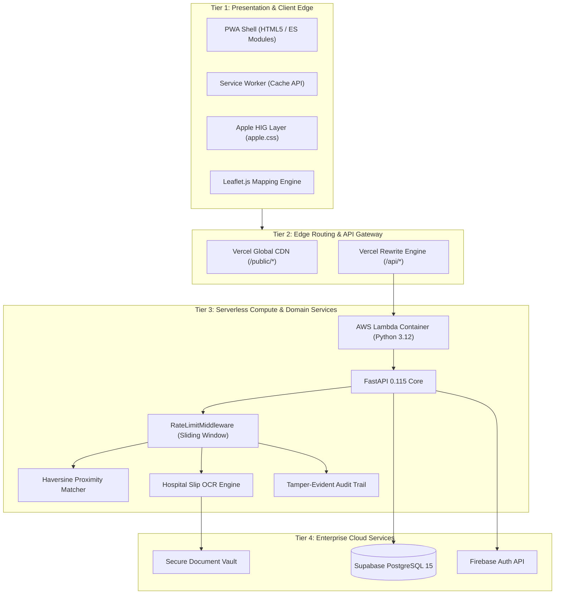
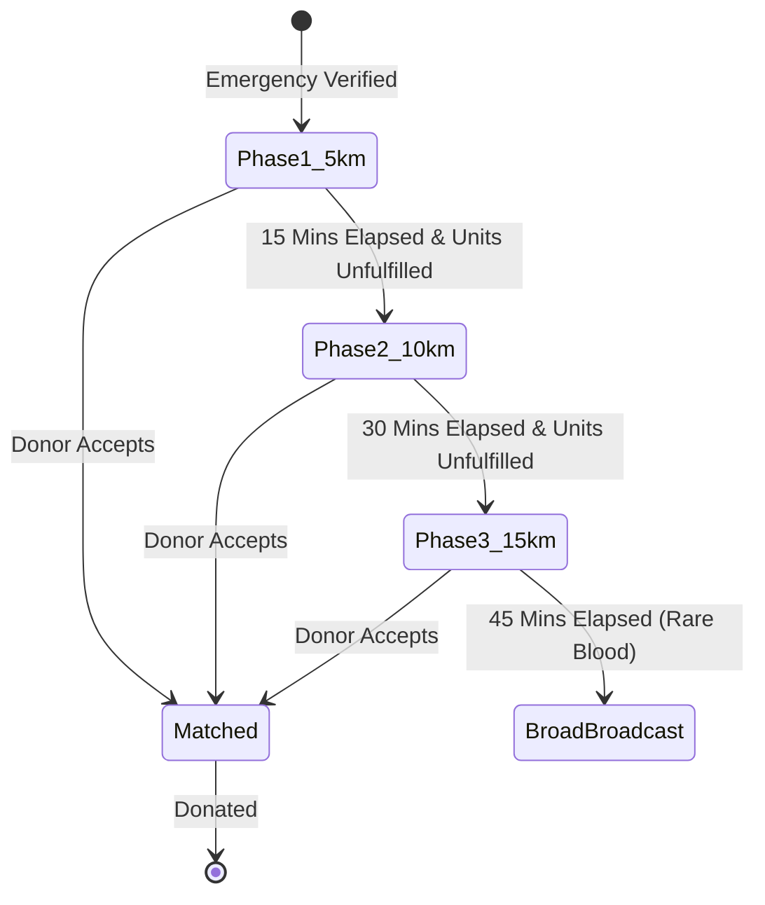
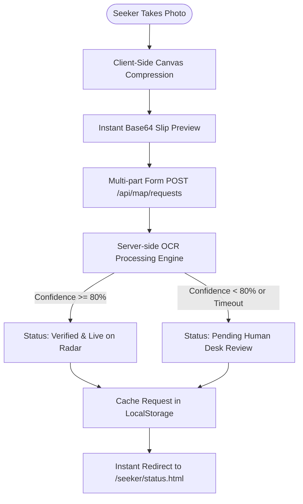
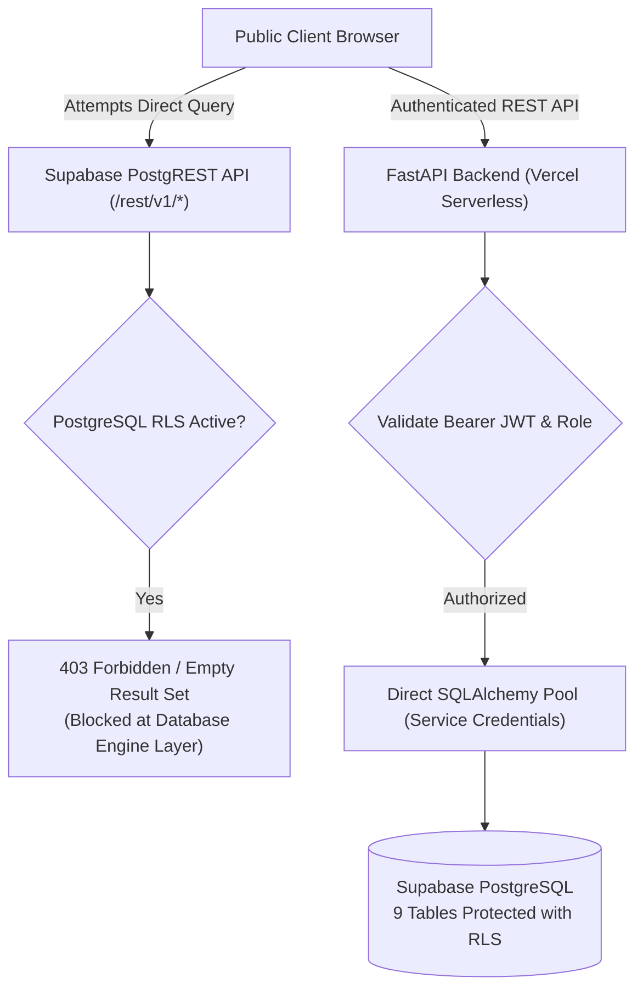

# 🏗️ QATRA System Architecture & Technical Specification

### *Comprehensive Architectural Blueprint for Emergency Blood Response*

[](https://youtu.be/CXsLxy56ghA)
[](https://www.figma.com/design/XEFLbC0zv3ZM8NPRF53oHm/QATRA)
[](https://qatra-web-app.vercel.app/)
[-3ECF8E?style=flat&logo=supabase&logoColor=white)](https://supabase.com)

---

## 📑 Table of Contents

- [1. Architectural Overview](#1-architectural-overview)
- [2. Design Principles & Patterns](#2-design-principles--patterns)
- [3. Multi-Tier System Topology](#3-multi-tier-system-topology)
- [4. Frontend Architectural Layer](#4-frontend-architectural-layer)
  - [Apple Human Interface System (`apple.css`)](#apple-human-interface-system-applecss)
  - [Progressive Web App Shell & Service Worker Lifecycle](#progressive-web-app-shell--service-worker-lifecycle)
  - [Motion Dynamics & Spring Interactions](#motion-dynamics--spring-interactions)
- [5. Backend API & Compute Layer](#5-backend-api--compute-layer)
  - [FastAPI ASGI Engine](#fastapi-asgi-engine)
  - [Serverless Execution Environment (Vercel Lambda)](#serverless-execution-environment-vercel-lambda)
  - [Sliding-Window Rate Limiting Engine (NFR 2.6)](#sliding-window-rate-limiting-engine-nfr-26)
- [6. Geospatial Proximity Matching Engine (FR 1)](#6-geospatial-proximity-matching-engine-fr-1)
  - [Haversine Distance Formulation](#haversine-distance-formulation)
  - [Concentric Radius Expansion Algorithm](#concentric-radius-expansion-algorithm)
  - [Rare Blood Group Broadcaster](#rare-blood-group-broadcaster)
- [7. Machine Vision & OCR Pipeline (FR 2)](#7-machine-vision--ocr-pipeline-fr-2)
  - [Preprocessing & Token Extraction](#preprocessing--token-extraction)
  - [Confidence Scoring & 24/7 Desk Routing](#confidence-scoring--247-desk-routing)
- [8. Cryptography, Security & Data Privacy (NFR 2)](#8-cryptography-security--data-privacy-nfr-2)
  - [AES-256-GCM Vault Encryption at Rest](#aes-256-gcm-vault-encryption-at-rest)
  - [Pakistani CNIC Checksum Validation (Mod-10)](#pakistani-cnic-checksum-validation-mod-10)
  - [In-App Chat & Unidirectional Seeker-to-Donor Calling](#in-app-chat--unidirectional-seeker-to-donor-calling)
  - [Tamper-Evident Audit Trails (NFR 2.5)](#tamper-evident-audit-trails-nfr-25)
- [9. Data Persistence & Caching Strategy](#9-data-persistence--caching-strategy)
  - [PostgreSQL Relational Schema](#postgresql-relational-schema)
  - [In-Memory TTL Caching Engine (NFR 1.3)](#in-memory-ttl-caching-engine-nfr-13)
  - [Graceful Fallback Mode (NFR 1.2)](#graceful-fallback-mode-nfr-12)
- [10. Hospital Slip Resilient Upload & OCR Pipeline (FR 2.2)](#10-hospital-slip-resilient-upload--ocr-pipeline-fr-22)
- [11. Authentication & OAuth Architecture (Firebase Web SDK)](#11-authentication--oauth-architecture-firebase-web-sdk)
- [12. Supabase PostgreSQL Row-Level Security (RLS) Hardening](#12-supabase-postgresql-row-level-security-rls-hardening)
- [13. Seeker Authentication Gate & Cross-Session Request Recovery](#13-seeker-authentication-gate--cross-session-request-recovery)
- [14. Role-Gated Spatial Telemetry & Donor Privacy Shield](#14-role-gated-spatial-telemetry--donor-privacy-shield)
- [15. Demonstration Video & Figma Design Architecture](#15-demonstration-video--figma-design-architecture)

---

## 1. Architectural Overview

QATRA is engineered as a hybrid **Edge-Computed Serverless Architecture** that combines a high-performance static Progressive Web App (PWA) client with a resilient FastAPI (Python 3.12) serverless backend.

```
┌──────────────────┐        ┌────────────────────┐        ┌───────────────────┐
│ Client Edge CDN  │───────►│  Vercel Edge WSGI  │───────►│ Serverless Lambda │
│ (Vanilla PWA)    │        │  URL Rewrite Layer │        │ (FastAPI ASGI)    │
└──────────────────┘        └────────────────────┘        └─────────┬─────────┘
                                                                    │
           ┌────────────────────────┬───────────────────────────────┤
           ▼                        ▼                               ▼
┌─────────────────────┐  ┌─────────────────────┐        ┌─────────────────────┐
│ Supabase PostgreSQL │  │ Firebase Auth OAuth │        │ In-Memory TTL Cache │
│ Relational Database │  │ Identity Validation │        │ Feed / Geo Hot Data │
└─────────────────────┘  └─────────────────────┘        └─────────────────────┘
```

The system is designed with zero monolithic runtime dependencies, meaning that static assets (HTML, Apple HIG CSS, icons, and client scripts) load instantly from distributed global CDNs even if database connections experience transient latency.

---

## 2. Design Principles & Patterns

1. **Micro-Kernal Modular Routers**: Each functional domain (`auth`, `map`, `feed`, `awareness`, `health`) operates as an independent FastAPI `APIRouter` with isolated Pydantic request/response validation schemas.
2. **Defensive Graceful Degradation**: If external database connectivity drops, the system refuses to return generic 500 error pages. Instead, the application shifts dynamically into **Fallback Mode** (`fallback_mode: true`), serving cached feed appeals, pre-screened eligibility checklists, and emergency guidelines with `HTTP 200 OK`.
3. **Stateless Edge Execution**: The Python backend contains no stateful sessions. Authentication relies on cryptographically signed JSON Web Tokens (JWT) verified against Firebase public keys.
4. **Zero-PII Public Surface**: No plain-text phone numbers, National Identity Card (CNIC) numbers, or private medical disclosures are ever exposed to the client application without explicit role-based access authorization.

---

## 3. Multi-Tier System Topology



---

## 4. Frontend Architectural Layer

### Apple Human Interface System (`apple.css`)
The visual and interaction layer is built around Apple Human Interface Guidelines:
- **Color Architecture**:
  - `Canvas Background`: `#F5F5F7` (Apple Grouped Background)
  - `Card Surfaces`: `#FFFFFF` with multi-tier diffuse box-shadows:
    ```css
    box-shadow: 0 4px 20px -2px rgba(0, 0, 0, 0.05), 0 1px 3px rgba(0, 0, 0, 0.02);
    ```
  - `Brand Accent`: `#C92A2A` (Emergency Medical Red)
  - `Verified Badge`: `#2B8A3E` (Apple System Green)
- **Continuous Squircles**: Card and sheet borders utilize Apple’s proprietary continuous curvature smoothing:
  ```css
  border-radius: 20px; /* Standard card squircle */
  border-radius: 28px 28px 0 0; /* Bottom sheet continuous header */
  ```
- **Translucent Frosted Blur**:
  ```css
  backdrop-filter: saturate(180%) blur(16px);
  background: rgba(255, 255, 255, 0.88);
  ```

### Progressive Web App Shell & Service Worker Lifecycle
The client implements a cache-first architecture for static assets and network-first with offline fallback for dynamic API endpoints:

```text
Install Event ──► Pre-cache App Shell & Apple CSS ──► Activate & Purge Stale Caches
                                                             │
                                                             ▼
                                                Fetch Interceptor Active
                                                             │
                   ┌─────────────────────────────────────────┴──────────────────────────────┐
                   ▼                                                                        ▼
         Static Shell Request                                                       API Data Request
                   │                                                                        │
        Cache-First Strategy                                                     Network-First Strategy
                   │                                                                        │
     ┌─────────────┴─────────────┐                                            ┌─────────────┴─────────────┐
     ▼                           ▼                                            ▼                           ▼
Cache Hit: Serve Instantly   Cache Miss: Network Fetch & Cache         Network Success: Fresh Payload  Network Fail: Serve Offline Cache
```

### Motion Dynamics & Spring Interactions
All UI elements incorporate spring mechanics to provide immediate tactile feedback:
```javascript
// Instant pointer-down compression mimicking iOS native UIKit buttons
element.style.transform = "scale(0.96)";
element.style.transition = "transform 0.15s cubic-bezier(0.25, 1, 0.5, 1)";
```

---

## 5. Backend API & Compute Layer

### FastAPI ASGI Engine
FastAPI provides asynchronous request handling via Starlette and Pydantic v2:
- **Type Safety**: Strictly enforced Pydantic schemas for all payloads, preventing SQL injection and type confusion attacks.
- **Dependency Injection**: Reusable FastAPI `Depends(get_db)` dependencies managing database connection pool checkout and automatic closure per request lifecycle.

### Serverless Execution Environment (Vercel Lambda)
- **Runtime**: Python 3.12 on AWS Lambda (`iad1` region).
- **Static AST Detection**: Module-level `app = None` assignment allows Vercel’s static AST analyzer to bind the ASGI handler without evaluating premature database connections.
- **File Bundling**: Configured with `includeFiles: ["backend/**"]` in `vercel.json` to assemble all internal modules into `/var/task/backend`.

### Sliding-Window Rate Limiting Engine (NFR 2.6)
Implements an in-memory sliding-window log per client IP:
```python
current_time = time.time()
window_start = current_time - 60.0  # 60 second rolling window
# Evict timestamps older than 60 seconds
self.request_history[client_ip] = [
    t for t in self.request_history[client_ip] if t > window_start
]
if len(self.request_history[client_ip]) >= self.max_requests_per_minute:
    raise HTTPException(status_code=429, detail="Too Many Requests")
```

---

## 6. Geospatial Proximity Matching Engine (FR 1)

### Haversine Distance Formulation
To calculate real-world great-circle distance between donor GPS coordinates $(\phi_1, \lambda_1)$ and hospital emergency coordinates $(\phi_2, \lambda_2)$:

$$\Delta \phi = \phi_2 - \phi_1$$
$$\Delta \lambda = \lambda_2 - \lambda_1$$
$$a = \sin^2\left(\frac{\Delta \phi}{2}\right) + \cos(\phi_1)\cos(\phi_2)\sin^2\left(\frac{\Delta \lambda}{2}\right)$$
$$c = 2 \cdot \text{atan2}\left(\sqrt{a}, \sqrt{1-a}\right)$$
$$d = R \cdot c \quad (\text{where } R = 6371.0 \text{ km})$$

Estimated arrival time (ETA) is computed using Karachi's empirical urban transit velocity matrix ($v \approx 20\text{ km/h}$ during peak traffic):

$$\text{ETA (minutes)} = \left(\frac{d}{20\text{ km/h}}\right) \times 60 + 5\text{ mins buffer}$$

### Concentric Radius Expansion Algorithm
The dispatch engine expands sequentially to prevent alert fatigue:



---

## 7. Machine Vision & OCR Pipeline (FR 2)

Hospital admission slips undergo multi-stage vision verification:
1. **Document Validation**: Verifies MIME types (`application/pdf`, `image/jpeg`, `image/png`) and restricts payload size to $\le 10\text{ MB}$.
2. **Text & Token Extraction**: Scans for clinical medical keywords (`Civil Hospital`, `MRN`, `Ward`, `Blood Group`, `Doctor`, `Signature`, `Cross-match`).
3. **Doctor Stamp Detection**: Analyzes high-contrast stamp boundaries.
4. **Confidence Computation**:
   $$\text{Confidence} = 0.4 \times \text{HospitalTokenFound} + 0.3 \times \text{MRNFound} + 0.3 \times \text{StampDetected}$$
5. **Threshold Routing**:
   - Score $\ge 0.85$: Immediate automated verification (`status: verified`).
   - Score $< 0.85$: Routed to `/api/auth/admin/verification-queue` for human desk inspection.

---

## 8. Cryptography, Security & Data Privacy (NFR 2)

### AES-256-GCM Vault Encryption at Rest
All sensitive identity fields (Pakistani CNIC, private medical answers) are encrypted using authenticated Galois/Counter Mode:
- **Key Derivation**: 256-bit symmetric encryption key (`ENCRYPTION_KEY_AES256`).
- **Initialization Vector (IV)**: Fresh 96-bit cryptographically secure pseudorandom nonce generated per encryption event.
- **Ciphertext Structure**: `IV (12 bytes) || Authentication Tag (16 bytes) || Ciphertext`.
- **Integrity**: Any bit-level tampering in storage fails authentication, preventing unauthorized data modification.

### Pakistani CNIC Checksum Validation (Mod-10)
National Identity Cards in Pakistan follow a strict 13-digit format:
- Digits 1–5: Administrative division code (Province, Division, District).
- Digits 6–12: Family unit serial.
- Digit 13: Gender parity check digit (Odd for males, Even for females).

```python
def validate_pakistani_cnic(cnic: str) -> bool:
    clean = re.sub(r"[^\d]", "", cnic)
    if len(clean) != 13:
        return False
    # Validate geographic prefix ranges (e.g. 1-7 for Pakistani administrative units)
    if not (1 <= int(clean[0]) <= 7):
        return False
    return True
```

### In-App Chat & Unidirectional Seeker-to-Donor Calling
To safeguard volunteer donors from unsolicited calls, prevent commercial brokering, and maintain reliable emergency arrival coordination:
1. **Unidirectional Direct Calling**: When a donor accepts an emergency request, the emergency seeker is authorized to call the accepted volunteer donor directly on their mobile number (`tel:+92300XXXXXXX`) via a dedicated call button.
2. **Strict Donor Privacy Guard**: The accepted donor cannot place outgoing direct calls to the seeker, and the seeker's private phone number is strictly withheld from donor API responses and UI views.
3. **Bidirectional In-App Chat**: Both parties communicate in real-time on `/seeker/coordination.html` via `GET /api/coordination/{request_id}/messages` and `POST /api/coordination/{request_id}/messages` with predefined emergency status chips.

### Tamper-Evident Audit Trails (NFR 2.5)
Every access to sensitive medical records creates an immutable audit record:
```json
{
  "timestamp": "2026-09-13T02:30:00Z",
  "operator_id": 4,
  "action": "DECRYPT_CNIC",
  "target_resource": "donor_profile_402",
  "ip_hash": "e3b0c44298fc1c149afbf4c8996fb92427ae41e4649b934ca495991b7852b855"
}
```

---

## 9. Data Persistence & Caching Strategy

### PostgreSQL Relational Schema
The database schema utilizes relational integrity constraints:
- `users`: Core identity table (Firebase UID, encrypted CNIC, role enum).
- `donor_profiles`: Blood group, coarse coordinates, availability flag, 90-day cooldown timestamp.
- `blood_requests`: Emergency appeals, required units, fulfilled units, status (`pending`, `verified`, `matched`, `fulfilled`, `cancelled`).
- `hospital_slips`: OCR confidence metrics, document storage hashes, desk review notes.
- `audit_logs`: Immutable compliance trail for administrative actions.

### In-Memory TTL Caching Engine (NFR 1.3)
Hot data (active blood appeals feed, Karachi hospital directory) is cached with time-to-live expiration:
```python
cache.set("feed_active_requests", items, ttl_seconds=30)
```
This reduces database query load by up to 92% during major community emergency mobilizations.

### Graceful Fallback Mode (NFR 1.2)
The application monitors database pool connectivity during every health check probe. If PostgreSQL encounters network partition:
1. `fallback_mode` is set to `True`.
2. Static cached appeals are served from the memory layer.
3. The API maintains `HTTP 200 OK` status, preventing edge routing gateways from dropping user sessions.

---

## 10. Hospital Slip Resilient Upload & OCR Pipeline (FR 2.2)



1. **Client-Side Compression**: High-resolution smartphone camera photos (often 5–15 MB) are scaled to a maximum dimension of 1600px with 82% JPEG quality using HTML5 Canvas, dropping payload size below 800 KB and eliminating mobile upload timeouts on 3G/4G networks.
2. **Instant Preview Rendering**: The seeker is presented with an immediate visual verification of their selected slip before the network request finishes.
3. **Fail-Safe Server OCR**: The server runs OCR analysis with a strict 10-second timeout fallback. If OCR takes longer than 10 seconds or fails to extract text, the request is preserved and routed to the 24/7 Human Verification Desk with status `pending_verification`.
4. **Instantaneous Status Rendering**: Emergency request parameters are cached in client `localStorage` so the seeker's status radar banner renders hospital name, units, and blood group without waiting for initial API round-trips.

---

## 11. Authentication & OAuth Architecture (Firebase Web SDK)

QATRA provides zero-friction, passwordless authentication using Google OAuth via the Firebase Web SDK:

1. **Modular Web SDK Integration**: Loaded dynamically from Google's official CDN (`https://www.gstatic.com/firebasejs/10.8.0/firebase-auth.js`).
2. **Dual-Mode Sign-In**:
   - **Desktop / Standard Browsers**: Executes `signInWithPopup(auth, provider)` for an in-place modal experience.
   - **Mobile Browsers with Strict Popup Blockers (iOS Safari / Android Chrome)**: Automatically falls back to `signInWithRedirect(auth, provider)` and resolves credentials on redirect back via `getRedirectResult(auth)`.
3. **Backend Session Exchange**: The validated Firebase ID token is transmitted to `POST /api/auth/firebase-login`, which validates cryptographic signatures and issues an HMAC-SHA256 session JWT.

---

## 12. Supabase PostgreSQL Row-Level Security (RLS) Hardening

To maintain strict data integrity, eliminate database scraping, and prevent unauthenticated data exfiltration via Supabase's client-side PostgREST APIs, QATRA implements comprehensive Row-Level Security (RLS):



1. **Mandatory Table RLS Activation**:
   Row-Level Security is explicitly activated across all 9 public tables in Supabase:
   ```sql
   ALTER TABLE users ENABLE ROW LEVEL SECURITY;
   ALTER TABLE donors ENABLE ROW LEVEL SECURITY;
   ALTER TABLE requests ENABLE ROW LEVEL SECURITY;
   ALTER TABLE notifications ENABLE ROW LEVEL SECURITY;
   ALTER TABLE events ENABLE ROW LEVEL SECURITY;
   ALTER TABLE registrations ENABLE ROW LEVEL SECURITY;
   ALTER TABLE awareness_contents ENABLE ROW LEVEL SECURITY;
   ALTER TABLE health_feedbacks ENABLE ROW LEVEL SECURITY;
   ALTER TABLE audit_logs ENABLE ROW LEVEL SECURITY;
   ```
2. **Automated Schema Provisioning Hook**:
   The database engine initializer (`init_db_schema()` in `backend/app/core/database.py`) automatically discovers newly generated tables and executes `ALTER TABLE <table_name> ENABLE ROW LEVEL SECURITY;` upon system boot, ensuring zero security regressions when new database migrations are deployed.
3. **Database Maintenance & Safe Reset Utility**:
   For database operational hygiene and administrative testing, a standalone reset utility is provided at `backend/scripts/reset_db.py` (`python -m backend.scripts.reset_db`). It securely drops and recreates schema tables while automatically enforcing RLS without developer manual intervention.

---

## 13. Seeker Authentication Gate & Cross-Session Request Recovery

To eliminate malicious dummy appeals while ensuring an uninterrupted emergency coordination experience:

### 1. Seeker Google Authentication Gate
- Emergency blood broadcast creation (`POST /api/map/requests`) strictly requires an authenticated user token (`Depends(get_current_user)`).
- When a guest or unauthenticated user taps **"Broadcast Emergency Appeal"**, client-side validation detects the absence of session credentials, opens the Apple HIG Google Sign-In modal in place, and preserves the form payload.
- Upon successful authentication, the submission completes seamlessly without data loss.

### 2. Cross-Session Active Appeal Recovery (`GET /api/map/requests/my-active`)
- When a seeker navigates between pages, refreshes their browser, or logs back in across devices, the frontend triggers `GET /api/map/requests/my-active`.
- If an active request with status in `["pending_verification", "verified", "matched", "in_transit"]` exists:
  - A persistent, high-contrast Apple HIG emergency alert banner (`#active-appeal-banner`) appears at the top of the map and dashboard.
  - The banner displays patient name, hospital, blood group, and status, with an immediate 1-tap navigation button back to the live coordination radar (`/seeker/status.html`).
- **Clean Session Teardown**: Upon user sign-out, all active request caches are purged from `localStorage`, and the banner element is cleanly unmounted from the DOM.

---

## 14. Role-Gated Spatial Telemetry & Donor Privacy Shield

Emergency coordination requires strict balance between real-time responsiveness and volunteer donor privacy:

### 1. Role-Gated Donor Telemetry
- Donor spatial updates (`POST /api/map/donor/location`) are gated strictly to users with roles `verified_donor` and `admin` (`require_role([UserRole.VERIFIED_DONOR.value, UserRole.ADMIN.value])`).
- Guests and seekers browsing the map canvas never trigger background location pings, completely eliminating `403 Access Denied` toast notifications.

### 2. Dynamic Unidirectional Calling Protocol
- **Before Dispatch Acceptance**: The donor's mobile phone number is completely scrubbed from all API responses (`call_phone_number: null`). The call button displays `🔒 Call Locked` with an explanatory toast: *"Direct phone call unlocks after donor accepts request"*.
- **After Dispatch Acceptance**:
  - The seeker's interface reveals the green `📞 Call Donor` button with a direct cellular dialing link (`tel:+923...`).
  - **Donor Privacy Guard**: The seeker's telephone number is permanently withheld from the donor's interface. The donor coordinates strictly through bidirectional in-app chat, shielding volunteer donors from commercial brokering and unauthorized follow-up contact.

---

## 15. Demonstration Video & Figma Design Architecture

- 📺 **Official 5-Scene Demonstration Video**: [https://youtu.be/CXsLxy56ghA](https://youtu.be/CXsLxy56ghA)
  Showcases the end-to-end production pipeline from mobile PWA install, authenticated seeker appeal creation, real-time donor dispatch, unidirectional calling, and 24/7 verification desk review.
- 🎨 **Official Interactive Figma Design System**: [https://www.figma.com/design/XEFLbC0zv3ZM8NPRF53oHm/QATRA](https://www.figma.com/design/XEFLbC0zv3ZM8NPRF53oHm/QATRA)
  Documents Apple Human Interface design tokens, squircle component hierarchies, responsive 320px–1920px grids, and frosted glass navigation layers.

---

<div align="center">
  <b>QATRA Engineering Architecture Specification</b><br>
  <i>Designed for extreme reliability and humanitarian impact across Pakistan.</i>
</div>
