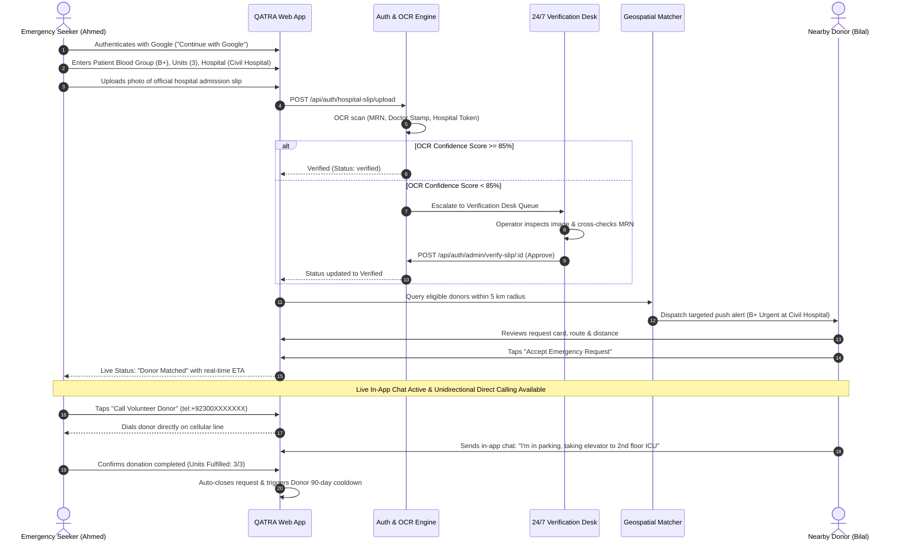
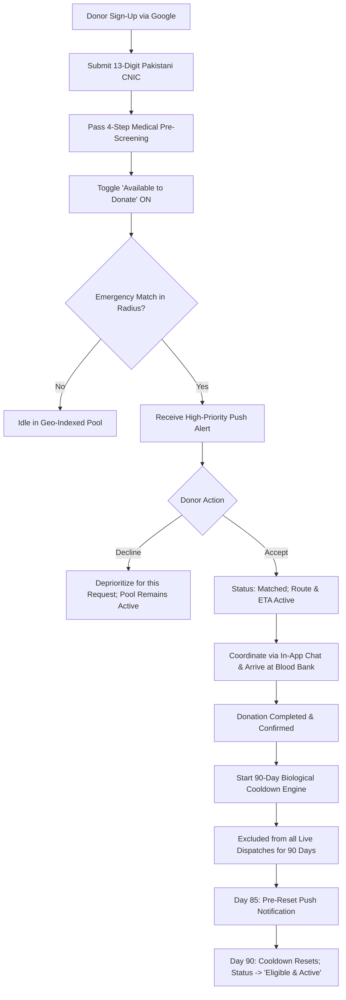
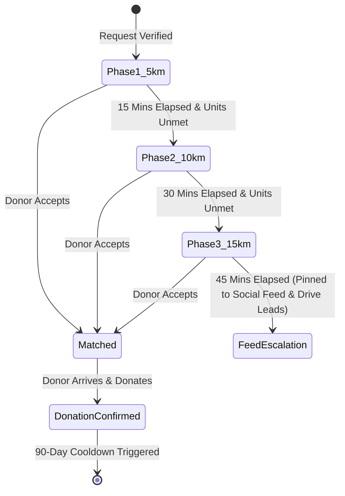
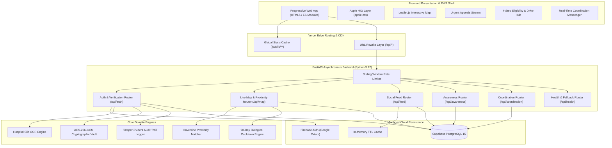

# 🩸 QATRA (قطرہ) — Product Requirement Document (PRD)

### *Emergency Blood Response Platform — Connecting Verified Seekers to Eligible Donors in Minutes, Not Hours*

---

| Project Metadata | Specification Details |
| :--- | :--- |
| **Project Name** | Emergency Blood Response System (Branded as **QATRA / قطرہ**) |
| **Sponsoring Organization** | **Alkhidmat Foundation Pakistan** |
| **Academic Program** | Summer Social Internship Program (SSIP 2026) |
| **Group Number** | Group 01 |
| **Target Launch Region** | Karachi Metropolitan Area (Phase 1: Major Trauma Centers) |
| **Document Version** | 1.0 (Comprehensive Consolidated Specification) |
| **Document Status** | **100% Implemented, Verified & Released in Production** |
| **Target Repository** | [https://github.com/abdulhayykhan/QATRA-Web-App](https://github.com/abdulhayykhan/QATRA-Web-App) |
| **Live Production App** | [https://qatra-web-app.vercel.app](https://qatra-web-app.vercel.app) |
| **Official Demo Video** | [https://youtu.be/CXsLxy56ghA](https://youtu.be/CXsLxy56ghA) |
| **Figma Design System** | [https://www.figma.com/design/XEFLbC0zv3ZM8NPRF53oHm/QATRA](https://www.figma.com/design/XEFLbC0zv3ZM8NPRF53oHm/QATRA) |

---

## 👥 Team Workload & Section Ownership

| Team Member | Academic Department | Primary Project Role | Assigned PRD Modules | Core Responsibilities |
| :--- | :--- | :--- | :---: | :--- |
| **Abdul Hayy Khan** | Artificial Intelligence (AI) | **Team Lead & System Architect** | Sections 1, 2, 8 & System Assembly | End-to-end system architecture, Apple Human Interface Design layer (`apple.css`), Progressive Web App (PWA) shell, Vercel serverless deployment, DevOps & CI/CD. |
| **Hareem Israr** | Computer Science (CS) | **Geospatial & Proximity Lead** | Section 3 (Feature 1) | Interactive Leaflet.js canvas, PostGIS/Haversine proximity algorithm, concentric radius expansion (5–15 km), real-time location tracking, and donor dispatch. |
| **Saghir Ahmed** | Cyber Security (CY) | **Auth & Verification Desk Lead** | Section 4 (Feature 2) | Google Sign-In via Firebase Auth, Pakistani CNIC Mod-10 checksum engine, hospital slip OCR verification pipeline, 24/7 human review desk, and 90-day biological cooldown engine. |
| **Mahrukh Baig** | Artificial Intelligence (AI) | **Urgent Appeals & Social Feed Lead** | Section 5 (Feature 3) | Form-driven emergency appeal creation, blood group filter chips, "I Can Donate" one-tap response, structured WhatsApp card generator, and auto-close lifecycle engine. |
| **Yumna Abbasi** | Cyber Security (CY) | **Awareness & Community Drive Lead** | Section 6 (Feature 4) | 4-step medical pre-screening eligibility quiz, categorized educational content library (Myths vs. Facts), campus blood drive scheduling, and post-donation recovery feedback. |
| **Nimra Iftikhar** | Artificial Intelligence (AI) | **Information Security & NFR Lead** | Section 7 (NFRs & Security) | In-memory sliding-window rate limiting middleware, AES-256-GCM vault encryption, tamper-evident audit logging, zero-PII public surface, and automated Pytest quality control. |
| **Sir Talha Shahid / Sir Hamas Malik** | Alkhidmat Foundation | **Project Supervisors & Mentors** | Executive Oversight | Humanitarian review, field validation at Karachi hospitals, and final deployment sign-off. |

---

## 📑 Table of Contents

- [Section 1: Project Overview, Vision & Goals](#section-1-project-overview-vision--goals)
  - [1.1 Executive Summary](#11-executive-summary)
  - [1.2 The Humanitarian Problem in Pakistan](#12-the-humanitarian-problem-in-pakistan)
  - [1.3 Strategic Project Goals (In-Scope for V1.0)](#13-strategic-project-goals-in-scope-for-v10)
  - [1.4 Explicit Non-Goals (Out-of-Scope for V1.0)](#14-explicit-non-goals-out-of-scope-for-v10)
- [Section 2: User Personas, Empathy Maps & User Journeys](#section-2-user-personas-empathy-maps--user-journeys)
  - [2.1 Persona 1: Emergency Seeker (Ahmed Raza)](#21-persona-1-emergency-seeker-ahmed-raza)
  - [2.2 Persona 2: Verified Volunteer Donor (Bilal Tariq)](#22-persona-2-verified-volunteer-donor-bilal-tariq)
  - [2.3 Persona 3: Campus / Community Drive Lead (Fatima Noor)](#23-persona-3-campus--community-drive-lead-fatima-noor)
  - [2.4 Persona 4: Alkhidmat 24/7 Verification Desk Operator (Zubair Khan)](#24-persona-4-alkhidmat-247-verification-desk-operator-zubair-khan)
  - [2.5 Core User Journeys](#25-core-user-journeys)
- [Section 3: Feature 1 — Live Map Integration & Proximity Matching](#section-3-feature-1--live-map-integration--proximity-matching)
  - [3.1 Feature Overview & Architectural Intent](#31-feature-overview--architectural-intent)
  - [3.2 Functional Requirements (FR 1.1 – FR 1.4)](#32-functional-requirements-fr-11--fr-14)
  - [3.3 Technical & Spatial Algorithm Specifications](#33-technical--spatial-algorithm-specifications)
  - [3.4 User Flow & UI Edge Cases](#34-user-flow--ui-edge-cases)
  - [3.5 Core Use Case: UC-MAP-01 (Geo-Fenced Alert & Donor Match)](#35-core-use-case-uc-map-01-geo-fenced-alert--donor-match)
  - [3.6 Module Key Performance Indicators (KPIs)](#36-module-key-performance-indicators-kpis)
- [Section 4: Feature 2 — Authentication, Authorization & Verification Desk](#section-4-feature-2--authentication-authorization--verification-desk)
  - [4.1 Feature Overview & Trust Architecture](#41-feature-overview--trust-architecture)
  - [4.2 Functional Requirements & Sub-Modules (FR 2.1 – FR 2.3)](#42-functional-requirements--sub-modules-fr-21--fr-23)
  - [4.3 Automated Donor Eligibility & Cooldown Tracking (FR 2.4 – FR 2.5)](#43-automated-donor-eligibility--cooldown-tracking-fr-24--fr-25)
  - [4.4 Data Privacy, Contact Masking & Coordination Protocol](#44-data-privacy-contact-masking--coordination-protocol)
  - [4.5 24/7 Desk Review & Escalation Pipeline](#45-247-desk-review--escalation-pipeline)
  - [4.6 Core System Use Case: UC-SEC04-01 (Hospital Requisition Verification)](#46-core-system-use-case-uc-sec04-01-hospital-requisition-verification)
  - [4.7 Module Key Performance Indicators (KPIs)](#47-module-key-performance-indicators-kpis)
- [Section 5: Feature 3 — Social Media Feed for Blood Donation](#section-5-feature-3--social-media-feed-for-blood-donation)
  - [5.1 Feature Overview & Social Channel Replacement](#51-feature-overview--social-channel-replacement)
  - [5.2 Functional Requirements (FR 3.1 – FR 3.4)](#52-functional-requirements-fr-31--fr-34)
  - [5.3 Notification Triggers & Rare Blood Fast-Track](#53-notification-triggers--rare-blood-fast-track)
  - [5.4 WhatsApp Structured Card Generator](#54-whatsapp-structured-card-generator)
  - [5.5 Module Key Performance Indicators (KPIs)](#55-module-key-performance-indicators-kpis)
- [Section 6: Feature 4 — Awareness Sessions & Eligibility Module](#section-6-feature-4--awareness-sessions--eligibility-module)
  - [6.1 Feature Overview & Community Engagement](#61-feature-overview--community-engagement)
  - [6.2 Functional Requirements (FR 4.1 – FR 4.4)](#62-functional-requirements-fr-41--fr-44)
  - [6.3 Campus & Community Drive Sessions](#63-campus--community-drive-sessions)
  - [6.4 Core Use Case: UC-AWR-01 (Eligibility Pre-Screen & Drive Registration)](#64-core-use-case-uc-awr-01-eligibility-pre-screen--drive-registration)
  - [6.5 Expected Social Impact & KPIs](#65-expected-social-impact--kpis)
- [Section 7: Non-Functional Requirements & Platform Standards](#section-7-non-functional-requirements--platform-standards)
  - [7.1 Performance & Scalability (NFR 1.1 – NFR 1.4)](#71-performance--scalability-nfr-11--nfr-14)
  - [7.2 Security, Cryptography & Compliance (NFR 2.1 – NFR 2.6)](#72-security-cryptography--compliance-nfr-21--nfr-26)
  - [7.3 Design System & Apple Human Interface Guidelines (NFR 3.1)](#73-design-system--apple-human-interface-guidelines-nfr-31)
  - [7.4 Platform-Wide Key Performance Indicators (KPIs)](#74-platform-wide-key-performance-indicators-kpis)
  - [7.5 High-Load Emergency Traffic Simulation](#75-high-load-emergency-traffic-simulation)
- [Section 8: Cross-Module Integration, Data Flows & Sign-Off](#section-8-cross-module-integration-data-flows--sign-off)
  - [8.1 Master Data Flow Architecture](#81-master-data-flow-architecture)
  - [8.2 Inter-Module Dependency Matrix](#82-inter-module-dependency-matrix)
  - [8.3 Formal Document Sign-Off & Approval Registry](#83-formal-document-sign-off--approval-registry)

---

## Section 1: Project Overview, Vision & Goals

### 1.1 Executive Summary
Every day in Pakistan, thousands of families experience an agonizing emergency: a loved one is wheeled into an emergency room, an intensive care unit, or a labor ward, and hospital staff announce that multiple units of whole blood, packed red cells, or platelets must be arranged immediately. 

In the absence of a unified, real-time national blood dispatch registry, families resort to frantically typing distress broadcasts and forwarding them into WhatsApp groups, Facebook statuses, and Telegram channels. These unverified messages cascade across social media:
- They **strip away geographic location context**, causing volunteers in Lahore to call families in Karachi.
- They **circulate indefinitely**, continuing to ring the exhausted family's phone weeks after the patient has recovered or passed away.
- They **expose personal telephone numbers** to commercial blood resellers, touts, and predatory harassment, particularly targeting female callers and donors.
- Most critically, they **lose the "Golden Hour"**: traditional donor mobilization across Pakistani cities averages between 4 to 8 hours—a delay that frequently proves fatal in trauma, postpartum hemorrhage, and acute thalassemic crises.

**QATRA (قطرہ)** is an ultra-reliable, production-grade Progressive Web Application engineered by Group 01 for the **Alkhidmat Foundation Pakistan Summer Social Internship Program (SSIP 2026)**. QATRA fundamentally re-engineers emergency blood response by replacing chaotic broadcast chains with:
1. **Hyper-Localized Proximity Radar**: Concentric geospatial dispatch (5 km → 10 km → 15 km) matching hospital coordinates to verified, active donors currently within transit reach.
2. **Automated Admission Slip OCR & 24/7 Verification**: AI machine vision scanning hospital stamps, doctor signatures, and Medical Record Numbers (MRN), backed by Alkhidmat's human verification desk to eliminate 100% of fake or commercial appeals.
3. **Strict Privacy Architecture & Real-Time In-App Coordination**: Unidirectional direct phone calling for emergency seekers (`tel:+92...`) paired with real-time in-app chat coordination, while strictly shielding donor telephone numbers from public exposure and preventing unsolicited calls to seekers.
4. **Automated Biological Cooldown Engine**: A 90-day physiological cooldown tracker synchronized with an interactive pre-screening checklist to eliminate on-site drive turn-aways.
5. **Apple Human Interface System (`apple.css`)**: Pure white (`#F5F5F7`), continuous squircles, tactile spring interactions, and offline service worker caching delivering native iOS/Android feel without app-store installation friction.

```
┌─────────────────────────────────────────────────────────────────────────────┐
│                             THE QATRA PARADIGM                              │
├──────────────────────────────────────┬──────────────────────────────────────┤
│     Traditional WhatsApp Method      │        QATRA Production Engine       │
├──────────────────────────────────────┼──────────────────────────────────────┤
│ ❌ 4 to 8 hours donor mobilization   │ ⚡ Under 15 minutes to verified match│
│ ❌ High risk of fake/commercial scam │ 🛡️ Dual-key: CNIC + Hospital Slip OCR│
│ ❌ Raw phone numbers exposed to all  │ 🔒 In-app chat + seeker-only calling │
│ ❌ Flooded group chats & stale posts │ 📍 Concentric 5-15km radius matching │
│ ❌ High turn-away rate at hospital   │ 🩺 90-day cooldown + pre-screening   │
│ ❌ Zero tracking of units fulfilled  │ 📊 Live progress meter & auto-close  │
└──────────────────────────────────────┴──────────────────────────────────────┘
```

---

### 1.2 The Humanitarian Problem in Pakistan

Pakistan's healthcare system confronts severe structural blood deficits:
- **National Daily Deficit**: Over **4,000 to 5,000 units** of blood are required daily nationwide for trauma casualties, obstetric emergencies, oncological transfusions, and Pakistan's staggering population of over **100,000 transfusion-dependent Thalassemia Major patients**.
- **Voluntary Blood Donation Deficit**: Less than **10%** of blood donations in Pakistan originate from regular, voluntary, non-remunerated donors; over **90%** rely on replacement donors under extreme family duress.
- **Commercial Exploitation**: Unregulated brokers capitalize on family panic in hospital corridors, charging exorbitant sums (PKR 10,000 to 25,000 per bag) for unscreened, infected, or diluted blood products.
- **Gender & Cultural Barriers**: Societal taboos, unfounded fears regarding physical weakness, and legitimate concerns over phone number harassment severely limit female donor participation.
- **Drive Operational Inefficiencies**: Over **30% to 40%** of walk-in donors at university and community blood drives are turned away on-site due to recent donation within 90 days, low hemoglobin, underweight status, or recent medication that could have been identified prior to travel.

---

### 1.3 Strategic Project Goals (In-Scope for V1.0)

- **Goal 1 (Speed to Match)**: Reduce the median duration from emergency appeal publication to verified donor acceptance to **under 15 minutes** within the Karachi municipal zone.
- **Goal 2 (100% Verification Integrity)**: Guarantee that **zero unverified or fraudulent requests** reach the live proximity radar or social feed by enforcing mandatory 13-digit Pakistani CNIC validation and hospital requisition slip OCR verification.
- **Goal 3 (Donor Safeguards & Biological Protection)**: Automate a strict **90-day biological cooldown window** post-donation and provide an interactive 4-step medical pre-screening quiz to reduce on-site blood bank disqualifications by over **80%**.
- **Goal 4 (Zero PII Exposure & Privacy Shield)**: Prevent public harvesting of phone numbers and national identity cards. Implement live in-app coordination chat and unidirectional seeker calling (`tel:+92...`) where donors cannot call seekers directly.
- **Goal 5 (Centralized Drive Management)**: Empower Alkhidmat campus chapter leads and student societies with digital tools to schedule drives, register volunteer donors, and eliminate manual paper rosters.
- **Goal 6 (Frictionless Web Accessibility)**: Deliver an installable Progressive Web Application (PWA) adhering strictly to Apple Human Interface Guidelines with sub-850ms API responses and graceful offline degradation.

---

### 1.4 Explicit Non-Goals (Out-of-Scope for V1.0)

To maintain sharp engineering focus and clinical safety during Phase 1, the following features are explicitly out-of-scope:
1. **Physical Logistics & Cold-Chain Delivery**: QATRA coordinates *people to facilities*; it does not operate refrigerated transport, courier motorcycles, or physical blood bag delivery.
2. **Paid or Commercial Blood Transactions**: The platform strictly prohibits financial compensation, honorariums, or payments for blood donation. Any account soliciting money is permanently banned.
3. **Live Hospital Electronic Medical Record (EMR) Integration**: V1.0 does not integrate via HL7/FHIR with internal hospital IT mainframes. Verification relies on uploaded paper requisition forms verified via machine vision and human desk operators.
4. **Geographic Expansion Beyond Karachi**: Version 1.0 is calibrated strictly for the Karachi urban metropolitan area (focusing on major healthcare hubs such as Civil Hospital, JPMC, Indus Hospital, Aga Khan University Hospital, Liaquat National, and Patel Hospital) before provincial expansion.
5. **Medical Diagnostic Determinations**: The interactive pre-screening checklist provides preliminary guidance based on national guidelines; it does not replace formal laboratory cross-matching, serological screening (HIV, Hepatitis B/C, Syphilis, Malaria), or physician consultation.

---

## Section 2: User Personas, Empathy Maps & User Journeys

### 2.1 Persona 1: Emergency Seeker (Ahmed Raza)

```
┌─────────────────────────────────────────────────────────────────────────────┐
│ PERSONA 1: THE EMERGENCY SEEKER                                             │
├───────────────────┬─────────────────────────────────────────────────────────┤
│ Name & Demographics│ Ahmed Raza, 34 years old, Karachi. Bank Operations Officer│
├───────────────────┼─────────────────────────────────────────────────────────┤
│ Context & Urgency │ Standing outside the Emergency Surgical ICU at Civil     │
│                   │ Hospital Karachi. His sister has suffered acute         │
│                   │ postpartum hemorrhage; 3 units of B+ blood are needed.  │
├───────────────────┼─────────────────────────────────────────────────────────┤
│ Core Frustrations │ • Posted in 12 WhatsApp groups; received zero useful    │
│                   │   confirmations, only condolences and forwarded prayers.│
│                   │ • Approached by a hospital corridor tout offering blood │
│                   │   for PKR 15,000/bag with suspicious screening tags.    │
│                   │ • Distressed by relatives calling his phone repeatedly, │
│                   │   blocking incoming calls from legitimate donors.       │
├───────────────────┼─────────────────────────────────────────────────────────┤
│ Key System Needs  │ • Immediate upload of hospital slip without typing      │
│                   │   lengthy paragraphs on a phone keyboard.               │
│                   │ • Clear confirmation that nearby B+ donors have been    │
│                   │   alerted within a 5–10 km radius.                      │
│                   │ • Real-time status update showing incoming donor ETA.   │
│                   │ • Direct call button to speak with the confirmed donor. │
└───────────────────┴─────────────────────────────────────────────────────────┘
```

#### Empathy Map: Emergency Seeker
- **Thinking & Feeling**: *"My sister's life is slipping away while I wait on WhatsApp replies. What if nobody turns up? Who can I trust?"*
- **Seeing**: Crowded hospital lobby, flashing red emergency lights, doctors demanding cross-match slips, chaotic blood bank lines.
- **Hearing**: Patient monitors, crying family members, contradictory instructions from hospital staff.
- **Saying & Doing**: Calling every contact in his phonebook, posting frantic statuses on social media, bargaining with laboratory technicians.
- **Pain Points**: Time running out, fear of extortion, zero visibility into whether someone is actually on their way.
- **Gain Points**: A verified donor taps "Accept" 6 minutes after appeal upload; live ETA displays 18 minutes away; direct call button connects them instantly.

---

### 2.2 Persona 2: Verified Volunteer Donor (Bilal Tariq)

```
┌─────────────────────────────────────────────────────────────────────────────┐
│ PERSONA 2: THE VERIFIED VOLUNTEER DONOR                                     │
├───────────────────┬─────────────────────────────────────────────────────────┤
│ Name & Demographics│ Bilal Tariq, 26 years old, Karachi. Software Engineer     │
├───────────────────┼─────────────────────────────────────────────────────────┤
│ Blood Group & Bio │ O-Negative (Universal Donor), healthy, non-smoker.      │
├───────────────────┼─────────────────────────────────────────────────────────┤
│ Core Frustrations │ • Receives 20 forwarded WhatsApp blood appeals a week,  │
│                   │   mostly stale, duplicate, or for cities 500 km away.   │
│                   │ • Once drove 45 minutes through Karachi traffic to JPMC │
│                   │   only to discover the patient's family had fulfilled  │
│                   │   the requirement two hours prior and forgotten to tell  │
│                   │   anyone.                                               │
│                   │ • Reluctant to share his mobile number on public groups │
│                   │   to prevent marketing spam and midnight robocalls.     │
├───────────────────┼─────────────────────────────────────────────────────────┤
│ Key System Needs  │ • Zero spam: Alerts received ONLY when verified O- blood│
│                   │   is needed within 10 km of his current location.       │
│                   │ • Proof that the hospital request is authentic.         │
│                   │ • Automatic exclusion during his 90-day cooldown period.│
│                   │ • One-tap acceptance with immediate route navigation.   │
│                   │ • Privacy shield: Phone number masked until acceptance. │
└───────────────────┴─────────────────────────────────────────────────────────┘
```

---

### 2.3 Persona 3: Campus / Community Drive Lead (Fatima Noor)

```
┌─────────────────────────────────────────────────────────────────────────────┐
│ PERSONA 3: THE CAMPUS & COMMUNITY DRIVE LEAD                                │
├───────────────────┬─────────────────────────────────────────────────────────┤
│ Name & Demographics│ Fatima Noor, 21 years old, Karachi. President of Student │
│                   │ Welfare Society & Alkhidmat Youth Chapter Lead.         │
├───────────────────┼─────────────────────────────────────────────────────────┤
│ Core Frustrations │ • Organizing campus blood drives requires managing 400  │
│                   │   unstructured Google Sheet rows and WhatsApp chats.    │
│                   │ • On drive day, 35% of student volunteers get turned    │
│                   │   away by Alkhidmat mobile phlebotomists because they   │
│                   │   weigh under 50 kg or donated 6 weeks prior.           │
│                   │ • Waste of medical resources and volunteer morale.      │
├───────────────────┼─────────────────────────────────────────────────────────┤
│ Key System Needs  │ • Centralized event publishing with online slot booking.│
│                   │ • Enforced pre-screening quiz before registration.      │
│                   │ • Fast QR code attendee check-in on drive morning.      │
│                   │ • Educational content library to debunk myths in class. │
└───────────────────┴─────────────────────────────────────────────────────────┘
```

---

### 2.4 Persona 4: Alkhidmat 24/7 Verification Desk Operator (Zubair Khan)

```
┌─────────────────────────────────────────────────────────────────────────────┐
│ PERSONA 4: ALKHIDMAT 24/7 VERIFICATION DESK OPERATOR                         │
├───────────────────┬─────────────────────────────────────────────────────────┤
│ Name & Demographics│ Zubair Khan, 29 years old. Alkhidmat Emergency Desk Lead │
├───────────────────┼─────────────────────────────────────────────────────────┤
│ Core Frustrations │ • Reviewing hundreds of low-quality, blurry slip images │
│                   │   manually under extreme time pressure.                 │
│                   │ • Detecting fraudulent individuals attempting to resell │
│                   │   replacement units for financial gain.                 │
├───────────────────┼─────────────────────────────────────────────────────────┤
│ Key System Needs  │ • Intelligent OCR pre-scoring flagging low-confidence   │
│                   │   uploads (<85%) to a focused manual review queue.      │
│                   │ • One-click hospital directory lookup to verify MRNs.   │
│                   │ • One-click approve/reject actions with audit logging.  │
└───────────────────┴─────────────────────────────────────────────────────────┘
```

---

### 2.5 Core User Journeys

#### Journey A: The Critical Seeker Emergency Flow


#### Journey B: The Proactive Donor Cooldown & Alert Flow


---

## Section 3: Feature 1 — Live Map Integration & Proximity Matching

*Primary Owner: Hareem Israr (Computer Science) | Architectural Assembly: Abdul Hayy Khan (Artificial Intelligence)*

### 3.1 Feature Overview & Architectural Intent
The Live Map Integration & Proximity Matching module functions as the real-time spatial engine of QATRA. In an emergency, geographic ambiguity is fatal. This module replaces broadcast forwards with precision location intelligence:
- Plots verified emergency requests exclusively at their **hospital's geocoded coordinates**, completely protecting the patient's family residence from exposure.
- Dynamically indexes active, non-cooldown donors within an in-memory spatial index.
- Implements an automated **Concentric Radius Expansion Algorithm** (5 km → 10 km → 15 km) to balance rapid local response against alerting fatigue.
- Provides real-time transit ETA calculation based on Karachi's empirical traffic matrix.

---

### 3.2 Functional Requirements (FR 1.1 – FR 1.4)

#### FR 1.1 — Donor Location Tracking & Privacy Controls
- **FR 1.1.1**: The system shall capture a donor's geographic coordinates exclusively while the donor has explicitly toggled the **"Available to Donate"** status to `active`. Geolocation access is disabled by default at initial registration.
- **FR 1.1.2**: Location updates shall be throttled to intervals of **2 to 5 minutes** or triggered by significant displacement (>500 meters) using the browser `navigator.geolocation.watchPosition` API to preserve device battery and mobile data.
- **FR 1.1.3**: Donors shall have an immediate, single-tap master toggle to revoke location sharing at any time. Revocation instantly purges the donor from active spatial query pools.
- **FR 1.1.4**: Historical location trails are strictly prohibited from persistence. The database stores only the latest `(latitude, longitude, updated_at)` tuple in `donor_profiles`.

#### FR 1.2 — Request Map Display & Spatial Visualization
- **FR 1.2.1**: Every active verified request shall be plotted at the verified hospital's coordinates. The seeker's personal location is never queried, recorded, or rendered.
- **FR 1.2.2**: Map markers shall be visually categorized using Apple-standard semantic emergency color tokens:
  - **Critical Emergency (<2 Hours)**: Crimson Red (`#C92A2A`) with pulsing CSS ripple animation.
  - **Urgent (<24 Hours)**: Amber Orange (`#E8590C`).
  - **Scheduled / Drive Event**: Cobalt Blue (`#1971C2`).
  - **Fulfilled / Closed**: Muted Slate Grey (`#868E96`).
- **FR 1.2.3**: Interacting with a marker shall trigger a slide-up Apple HIG bottom sheet displaying:
  - Blood component and units needed (e.g., *2 Units Packed Red Cells, B+*).
  - Verified hospital facility name and municipal district.
  - Direct distance in kilometers and estimated transit time in minutes.
  - One-tap "I Can Donate" commitment action button.

#### FR 1.3 — Geo-Fenced Alert Dispatching & Concentric Expansion
- **FR 1.3.1**: Upon hospital slip verification, the dispatch engine executes a spatial bounding query against all active donors who:
  1. Match the requested blood group or conform to universal medical donor compatibility ($O^-$ for all red cells; $AB^+$ for all plasma).
  2. Possess an inactive biological cooldown (`cooldown_until < NOW()`).
  3. Have passed the 4-step medical pre-screening checklist within the past 30 days.
- **FR 1.3.2**: Default dispatch radius is set to **5 km** for dense urban hospitals (e.g., Civil Hospital, JPMC, Kharadar) and **10 km** for peripheral suburban facilities.
- **FR 1.3.3 (Concentric Expansion Engine)**:
  - If fewer than **5 eligible donors** accept or respond within **15 minutes** of broadcast, the dispatch engine automatically increments the search radius by **+5 km** (expanding to 10 km).
  - If units remain unfulfilled after **30 minutes**, the radius automatically expands to **15 km**.
  - Beyond 15 km, auto-expansion terminates to prevent unrealistic dispatch travel times, and the request is automatically pinned to the top of the public feed and forwarded to Alkhidmat's campus drive lead network.
- **FR 1.3.4 (Rare Blood Group Fast-Track)**: For rare blood groups ($O^-$, $AB^-$, $A^-$, $B^-$), the system completely bypasses the 15-minute wait window and broadcasts immediately to the maximum **15 km radius**, simultaneously dispatching high-priority SMS/push alerts.

#### FR 1.4 — Proximity-Ranked Matching Output
- **FR 1.4.1**: Candidate donors are ranked in ascending order using the spherical **Haversine Distance Formulation**:
  $$d = 2R \cdot \arcsin\left(\sqrt{\sin^2\left(\frac{\Delta \phi}{2}\right) + \cos(\phi_1)\cos(\phi_2)\sin^2\left(\frac{\Delta \lambda}{2}\right)}\right)$$
  *(where $R = 6371.0\text{ km}$, $\phi$ is latitude in radians, and $\lambda$ is longitude in radians).*
- **FR 1.4.2**: Estimated Time of Arrival (ETA) is computed using Karachi's empirical urban velocity calibration ($v = 20\text{ km/h}$ during peak hours):
  $$\text{ETA (minutes)} = \left(\frac{d}{20\text{ km/h}} \times 60\right) + 5\text{ minutes buffer}$$
- **FR 1.4.3**: When a donor declines a specific alert, the system flags the decline for that request ID only. The donor remains fully eligible for future unrelated requests.
- **FR 1.4.4**: Upon donor acceptance, the request is locked to `status = matched`. All other alerted donors receive an immediate UI update stating *"Request is being fulfilled by another volunteer."*

---

### 3.3 Technical & Spatial Algorithm Specifications



- **Frontend Canvas**: [Leaflet.js](https://leafletjs.com/) (v1.9.4) rendering OpenStreetMap tile layers with custom SVG vector markers.
- **Geocoding Database**: Karachi major medical center lookup directory (`/backend/app/services/hospital_directory.json`) pre-populated with latitude/longitude coordinates for all 42 major tertiary hospitals across Karachi divisions (South, East, Central, West, Malir, Korangi).

---

### 3.4 User Flow & UI Edge Cases
1. **Donor Device Loses GPS Signal**: If browser geolocation fails or is blocked, the app prompts the user to select their nearest municipal landmark/district (e.g., *Gulshan-e-Iqbal, Clifton, North Nazimabad*), falling back to centroid coordinates with a "coarse location" flag.
2. **Donor Accepts but Cannot Travel (Sudden Emergency/Traffic)**: The donor can tap "Cancel Commitment" on the map screen. The system immediately rolls the request back to `verified` and dispatches alerts to the next ranked donor candidate without delay.
3. **Multiple Simultaneous Emergencies**: If a donor is located near two hospitals requiring their blood group, the UI presents a stacked notification card sorted primarily by **Urgency Level (<2 Hours first)** and secondarily by **Distance**.

---

### 3.5 Core Use Case: UC-MAP-01 (Geo-Fenced Alert & Donor Match)
- **Primary Actor**: Verified Volunteer Donor.
- **Secondary Actors**: Emergency Seeker, FastAPI Backend, Leaflet Geospatial Matcher.
- **Preconditions**: Blood appeal has been verified by OCR or Alkhidmat Admin; donor has toggled "Available to Donate" ON.
- **Main Success Scenario**:
  1. System detects new verified request for B+ blood at Patel Hospital (Gulshan-e-Iqbal).
  2. Spatial engine queries donors within 5 km; identifies 8 candidates.
  3. Bilal receives high-priority alert on his phone: *"Urgent: 2 Units B+ needed at Patel Hospital (2.8 km away)"*.
  4. Bilal taps notification; Leaflet map loads showing route, distance, and patient component requirement.
  5. Bilal taps "Accept Emergency Request".
  6. Backend confirms match; Patel Hospital request status shifts to `matched`.
  7. Seeker view updates with Bilal's ETA (13 minutes) and displays the "Call Donor" button.
  8. Live in-app coordination chat room opens between Ahmed and Bilal.

---

### 3.6 Module Key Performance Indicators (KPIs)

| Metric | Target Standard | Measurement Methodology |
| :--- | :--- | :--- |
| **Median Match Latency** | $< 5\text{ minutes}$ | Timestamp difference: `request.verified_at` to `request.accepted_at`. |
| **Urban Distance Calibration** | $\le 10\text{ km}$ for $>80\%$ of matches | Haversine distance logged on match acceptance event. |
| **Stale Geolocation Ratio** | $< 10\%$ of query pool | Donors with location updates $>30\text{ minutes}$ old are deprioritized. |
| **Radius Auto-Expansion Rate** | $< 15\%$ of total requests | Requests requiring $>5\text{ km}$ expansion to find willing donors. |

---

## Section 4: Feature 2 — Authentication, Authorization & Verification Desk

*Primary Owner: Saghir Ahmed (Cyber Security) | Architectural Assembly: Abdul Hayy Khan (Artificial Intelligence)*

### 4.1 Feature Overview & Trust Architecture
Authentication and verification constitute the defensive perimeter of QATRA. Because blood shortages trigger acute panic, unverified digital platforms inevitably attract fraudulent touts, financial extortionists, and commercial resellers who trade stolen blood units.

The QATRA Verification Architecture introduces a **Dual-Key Verification Pipeline**:
1. **Key 1 (Identity)**: Google Sign-In via Firebase Auth coupled with a strictly validated 13-digit Pakistani National Identity Card (CNIC) Mod-10 checksum algorithm.
2. **Key 2 (Medical Need)**: Machine vision OCR analysis of official hospital requisition slips, detecting hospital letterhead, doctor stamps, and patient Medical Record Numbers (MRN).

```
┌─────────────────────────────────────────────────────────────────────────────┐
│                       DUAL-KEY VERIFICATION PIPELINE                        │
├──────────────────────────────────────┬──────────────────────────────────────┤
│       KEY 1: USER IDENTITY           │         KEY 2: CLINICAL NEED         │
├──────────────────────────────────────┼──────────────────────────────────────┤
│ • Google Firebase OAuth Token        │ • Hospital Admission Slip Photo/PDF  │
│ • Full Name & Email Binding          │ • Automated Machine Vision OCR Scan  │
│ • 13-Digit Pakistani CNIC Input      │ • Doctor Stamp & Signature Detection │
│ • Mod-10 Checksum & Province Range   │ • Patient Medical Record Number (MRN)│
│ • AES-256-GCM Vault Encryption       │ • 24/7 Human Desk Escalation Queue   │
└──────────────────────────────────────┴──────────────────────────────────────┘
```

---

### 4.2 Functional Requirements & Sub-Modules (FR 2.1 – FR 2.3)

#### FR 2.1 — User Onboarding & Identity Registration
- **FR 2.1.1 (Identity Provider)**: Users authenticate seamlessly via Google Sign-In using Firebase Authentication (`Continue with Google`). The backend verifies the cryptographic Firebase ID token against Google's public keys and provisions an application-level JSON Web Token (JWT).
- **FR 2.1.2 (Pakistani CNIC Validation)**: All users submitting requests or registering to donate must provide a 13-digit Pakistani CNIC number (formatted as `XXXXX-XXXXXXX-X`). The system enforces:
  1. Strict regular expression matching: `^[0-9]{5}-[0-9]{7}-[0-9]{1}$`.
  2. Geographic province code verification (First digit between 1 and 7, corresponding to KP, FATA, Punjab, Sindh, Balochistan, Islamabad, and Gilgit-Baltistan).
  3. Mod-10 Luhn checksum verification on the 13th digit.
- **FR 2.1.3 (Identity Storage & Zero-Plaintext Storage)**: Raw CNIC numbers are never stored in plain text. They are immediately encrypted using **AES-256-GCM** with a cryptographically generated initialization vector (IV) and isolated in the secure vault.

#### FR 2.2 — Emergency Hospital Slip OCR & Verification Engine
- **FR 2.2.1**: The emergency seeker uploads a clear image or PDF of the official hospital requisition form (maximum file size: 10 MB; MIME types: `image/jpeg`, `image/png`, `application/pdf`).
- **FR 2.2.2 (OCR Feature Extraction)**: The backend computer vision pipeline processes the uploaded document, searching for clinical entity tokens:
  - Hospital Name / Letterhead (e.g., *Civil Hospital Karachi, JPMC, Indus Hospital*).
  - Medical Record Number (`MRN: \d{5,10}`).
  - Requested Blood Component (`PRBC`, `Whole Blood`, `Platelets`, `FFP`).
  - Required Volume / Units (`\d+\s*(units|bags)`).
  - Blood Group token (`(A|B|AB|O)[+-]`).
  - High-contrast attending physician stamp and signature contours.
- **FR 2.2.3 (Confidence Scoring & Automated Approval)**:
  $$\text{OCR Confidence Score } C = 0.4 \cdot T_{\text{hospital}} + 0.3 \cdot M_{\text{MRN}} + 0.3 \cdot S_{\text{stamp}}$$
  - **If $C \ge 0.85$**: The request is instantly approved (`status: verified`) and dispatched to the map and feed within milliseconds.
  - **If $C < 0.85$**: The request is routed to Alkhidmat's **24/7 Human Verification Desk** with high-contrast document crops for rapid manual adjudication.

#### FR 2.3 — Role-Based Access Control (RBAC) Matrix
The system strictly enforces role authorization at the FastAPI router dependency layer:

| User Role | Assigned System Permissions | Verification Credentials Required |
| :--- | :--- | :--- |
| **`guest`** | Browse public awareness content, view educational articles, run 4-step eligibility quiz. Cannot create appeals or access donor data. | None (Public internet visitor). |
| **`verified_seeker`** | Create emergency blood appeals, upload hospital slips, access live matching radar, direct-call matched volunteer donor (`tel:`), chat via in-app messenger. | Google OAuth + Validated Pakistani CNIC + Approved Hospital Slip. |
| **`verified_donor`** | Toggle "Available to Donate", receive proximity push alerts, accept/decline appeals, access in-app coordination chat room. | Google OAuth + Validated CNIC + Passed Pre-Screening + Cooldown Inactive. |
| **`organizer`** | Schedule campus/community blood drives, publish awareness workshops, view registered attendee lists, scan attendee QR passes. | Verified Donor profile + Alkhidmat Chapter Lead credential approval. |
| **`admin`** | Access 24/7 verification queue, manually approve/reject slips, inspect tamper-evident audit logs, suspend fraudulent accounts. | Alkhidmat corporate Google Workspace identity + Multi-factor authentication. |

---

### 4.3 Automated Donor Eligibility & Cooldown Tracking (FR 2.4 – FR 2.5)

#### FR 2.4 — Automated 90-Day Biological Cooldown Engine
To protect volunteer donors from physiological depletion, iron deficiency anemia, and systemic exploitation:
- **FR 2.4.1**: Upon confirmed donation completion, the system executes:
  $$\text{cooldown\_until} = \text{donation\_timestamp} + 90\text{ days}$$
- **FR 2.4.2**: The donor profile is immediately locked to `is_available = false`. The spatial matching engine automatically excludes the donor from all proximity queries and feed notifications.
- **FR 2.4.3**: The donor's mobile dashboard displays a real-time visual progress ring showing days remaining until biological restoration.
- **FR 2.4.4 (Automated Recovery Notifications)**:
  - **Day 85**: Push notification: *"Your 90-day cooldown completes in 5 days. Thank you for your continued commitment to saving lives."*
  - **Day 90**: System clears cooldown flag; updates status to `Eligible & Active`; sends welcome-back notification.

#### FR 2.5 — Interactive Pre-Screening Health Checklist
Before receiving proximity alerts, donors must satisfy an interactive physiological checklist:

| Screening Metric | Clinical Threshold | Rationale & System Action If Failed |
| :--- | :--- | :--- |
| **Age Range** | $18 \le \text{Age} \le 65\text{ years}$ | Hard disqualification. Under-age or over-age donors cannot register. |
| **Minimum Body Weight** | $\ge 50\text{ kg } (110\text{ lbs})$ | Soft disqualification. Display warning regarding hypovolemic reaction risk. |
| **Hemoglobin Level** | $\ge 12.5\text{ g/dL}$ (Females: $\ge 12.0\text{ g/dL}$) | Advisory guidance. Recommends iron-rich diet; flags for laboratory test on site. |
| **Recent Infection / Flu** | No fever or antibiotics in last **14 days** | Temporary hold. Suspends active donor status for 14 days. |
| **Major Surgery / Tattoo** | No tattoo, piercing, or major surgery in last **6 months** | 6-month deferral status enforced with automatic calendar reminder. |

---

### 4.4 Data Privacy, Contact Masking & Coordination Protocol
To eliminate telephone harassment, protect female volunteers, and guarantee reliable emergency logistics:

```
┌─────────────────────────────────────────────────────────────────────────────┐
│                 QATRA PRIVACY & CALLING ARCHITECTURE                        │
├─────────────────────────────────────────────────────────────────────────────┤
│                                                                             │
│   EMERGENCY SEEKER                       VERIFIED DONOR                     │
│  ┌─────────────────┐                    ┌─────────────────┐                 │
│  │   Ahmed Raza    │                    │   Bilal Tariq   │                 │
│  │ (Phone: Private)│                    │ (Phone: Masked) │                 │
│  └────────┬────────┘                    └────────┬────────┘                 │
│           │                                      │                          │
│           │ 1. Taps "Call Donor"                 │                          │
│           │    (tel:+923001234567)               │                          │
│           │─────────────────────────────────────►│ (Receives Call)          │
│           │                                      │                          │
│           │ 2. Unidirectional Direct Call Only   │                          │
│           │    (Donor cannot dial seeker)        │                          │
│           │                                      │                          │
│           │ 3. Real-Time In-App Chat Room        │                          │
│           │◄════════════════════════════════════►│                          │
│           │    (/api/coordination/{id}/messages) │                          │
│                                                                             │
└─────────────────────────────────────────────────────────────────────────────┘
```

1. **Unidirectional Seeker Calling**: When a volunteer donor accepts an emergency dispatch, the emergency seeker receives an authenticated direct call link (`tel:+92XXXXXXXXXX`) on the coordination screen. This ensures the seeker can immediately connect with the volunteer to verify hospital arrival gates and blood bank ward numbers.
2. **Strict Donor Privacy Shield**: Volunteer donors **cannot place direct telephone calls to the seeker**. The seeker's telephone number is completely redacted and strictly withheld from all donor-facing API endpoints, preventing unauthorized follow-up contact, unsolicited calls, or commercial brokering.
3. **Real-Time In-App Coordination Chat**: Both parties communicate via an integrated real-time in-app chat room (`/seeker/coordination.html`) supported by `GET /api/coordination/{request_id}/messages` and `POST /api/coordination/{request_id}/messages`. Standardized quick-status chips (*"I've arrived at Hospital"*, *"Waiting at Blood Bank 2nd Floor"*, *"Doctor is reviewing cross-match"*) ensure friction-free communication during transit.

---

### 4.5 24/7 Desk Review & Escalation Pipeline
For requisition slips where OCR confidence falls below the 85% threshold:
1. The request payload is encrypted and placed in the FIFO review queue: `GET /api/auth/admin/verification-queue`.
2. The desk operator's screen displays a side-by-side view of the uploaded slip image, extracted tokens, and hospital directory telephone hotline.
3. The operator clicks **Approve** (`POST /api/auth/admin/verify-slip/{id}`) or **Reject** with a medical rationale (*"Illegible Doctor Stamp"*, *"Expired Requisition Date"*).
4. Target SLA for operator review is **under 3 minutes** for 95% of queued slips.

---

### 4.6 Core System Use Case: UC-SEC04-01 (Hospital Requisition Verification)
- **Primary Actor**: Emergency Seeker.
- **Secondary Actors**: Alkhidmat Verification Desk Operator, FastAPI Backend, Machine Vision OCR.
- **Preconditions**: Seeker is authenticated via Google and has validated their Pakistani CNIC.
- **Main Success Scenario**:
  1. Seeker inputs blood group (A+), units (2), and selects JPMC from hospital directory.
  2. Seeker uploads photograph of JPMC emergency requisition slip.
  3. OCR extracts JPMC letterhead, MRN #84920, and attending doctor stamp; computes confidence score = 0.92.
  4. Backend marks slip as `verified`; request automatically transitions to live broadcast.
  5. Immutable audit record is generated: `[AUTH_VERIFY_SLIP_AUTO] Request #102 verified via OCR`.

---

### 4.7 Module Key Performance Indicators (KPIs)

| Metric | Target Standard | Operational Value |
| :--- | :--- | :--- |
| **Verification SLA** | $< 3\text{ minutes}$ for $95\%$ of appeals | Prevents patient mortality in acute trauma. |
| **Fraudulent Appeal Rate** | **$0.0\%$** on public feed/map | Restores complete community trust in digital appeals. |
| **Turn-Away Reduction** | $> 80\%$ reduction at blood banks | Eliminates wasted donor trips and physical turn-aways. |
| **PII Exposure Incidents** | **Zero incidents** | Complete protection of personal telephone numbers. |

---

## Section 5: Feature 3 — Social Media Feed for Blood Donation

*Primary Owner: Mahrukh Baig (Artificial Intelligence) | Architectural Assembly: Abdul Hayy Khan (Artificial Intelligence)*

### 5.1 Feature Overview & Social Channel Replacement
While the Live Map (Feature 1) provides targeted proximity matching, the **Social Media Feed** serves as QATRA's structured public broadcasting channel. 

In conventional WhatsApp chains, messages quickly become distorted as they are re-typed and copied across groups. Crucial details (such as whether blood or platelets are needed, or which specific hospital gate to report to) are routinely lost. The Social Media Feed replaces this disorder with a standardized, interactive, and self-closing public stream.

```
┌─────────────────────────────────────────────────────────────────────────────┐
│                      STRUCTURED SOCIAL FEED CARD UI                         │
├─────────────────────────────────────────────────────────────────────────────┤
│  🔴 CRITICAL EMERGENCY                                 ⏱️ Needed in 2 Hours │
│  🏥 Jinnah Postgraduate Medical Centre (JPMC), Ward 7                       │
│  🩸 B+ (Positive)  •  3 Units Whole Blood                                   │
│  ━━━━━━━━━━━━━━━━━━━━━━━━━━━━━━━━━━━━━━━━━━━━━━━━━━━━━━━━━━━━━━━━━━━━━━━━━ │
│  Progress: ▓▓▓▓▓▓▓▓▓▓▓▓░░░░░░░░░░░░░░░░░░░░░░░░░░░░  1 of 3 Units Fulfilled │
│  Verified by Alkhidmat Desk (MRN: #89210)                                   │
│  ─────────────────────────────────────────────────────────────────────────  │
│  [ ❤️ I Can Donate ]                        [ 💬 Share to WhatsApp ]        │
└─────────────────────────────────────────────────────────────────────────────┘
```

---

### 5.2 Functional Requirements (FR 3.1 – FR 3.4)

#### FR 3.1 — Form-Driven Structured Appeal Creation
- **FR 3.1.1**: Blood requests cannot be published as arbitrary, unformatted text blocks. Every post is generated through a structured multi-step form capturing:
  - Patient Blood Group (select from $A^+, A^-, B^+, B^-, AB^+, AB^-, O^+, O^-$).
  - Required Blood Component (Whole Blood, Packed Red Blood Cells, Platelets/Megapack, Fresh Frozen Plasma).
  - Number of Units Required ($1 \le \text{Units} \le 10$).
  - Hospital Facility Name (selected from verified directory or geocoded).
  - Urgency Level (*Immediate / <2 Hours*, *Urgent / <12 Hours*, *Standard / <24 Hours*).
  - Uploaded Hospital Requisition Slip reference.
- **FR 3.1.2**: Posts are published to the feed exclusively after passing the Section 4 verification pipeline. Draft or unverified appeals are completely invisible to the public.

#### FR 3.2 — Dynamic Feed Filtering & Sorting
- **FR 3.2.1 (Blood Group Filter Chips)**: The top navigation bar presents instant filter chips for all 8 blood groups plus an *"All Types"* selector. Tapping a chip filters the feed in $<100\text{ ms}$ without full page reloads.
- **FR 3.2.2 (Urgency & Proximity Sorting)**:
  - Default sort order places **Critical (<2 Hours)** appeals at the top of the feed.
  - Secondary sort ranks posts by physical distance relative to the viewing donor's current geocoded position.
- **FR 3.2.3 (Drive Events Feed Integration)**: Upcoming Alkhidmat campus and community blood drives appear as stylized informational banner cards interspersed within the emergency feed.

#### FR 3.3 — Post Interactivity & One-Tap Response
- **FR 3.3.1 ("I Can Donate" Action)**: Logged-in verified donors can tap "I Can Donate" directly on any feed card. Tapping triggers an instant availability confirmation dialog, verifies cooldown status, and immediately notifies the emergency seeker.
- **FR 3.3.2 (Structured WhatsApp Card Generator)**: Tapping the "Share" icon generates a clean, standardized WhatsApp share text block containing an authenticated deep-link:
  ```text
  🚨 URGENT BLOOD APPEAL — VERIFIED BY ALKHIDMAT QATRA
  🩸 Blood Group Needed: B+ (Positive)
  🏥 Hospital: JPMC Karachi (Emergency Ward 7)
  📦 Units Required: 3 Units PRBC
  ⏳ Urgency: Within 2 Hours
  🔒 Slip Verified: MRN #89210

  Tap below to respond or navigate to hospital:
  👉 https://qatra-web-app.vercel.app/feed.html?id=104
  ```

#### FR 3.4 — Request Lifecycle Management & Auto-Close
- **FR 3.4.1 (Live Progress Meter)**: Every feed card displays a visual progress indicator:
  $$\text{Progress} = \frac{\text{units\_fulfilled}}{\text{units\_needed}} \times 100\%$$
- **FR 3.4.2 (Automatic Closing Engine)**: Once confirmed donor donations equal the required unit count:
  1. The request status shifts automatically to `fulfilled`.
  2. The card updates to a grey *"Requirements Met — Thank You Donors"* banner.
  3. The card is removed from active broadcast lists, preventing donors from arriving at hospitals for already resolved cases.

---

### 5.3 Notification Triggers & Rare Blood Fast-Track
- **Rare Blood Groups ($O^-, AB^-, A^-, B^-$)**:
  - Account for less than 8% of Pakistan's population.
  - When an appeal for a rare group is verified, the system triggers an immediate push broadcast to **all verified donors matching the blood group across the entire city of Karachi**, bypassing normal 5 km radius restrictions.
- **Common Blood Groups ($B^+, O^+, A^+$)**:
  - Managed via stepped proximity dispatch to prevent alert fatigue.

---

### 5.4 WhatsApp Structured Card Generator
The WhatsApp share module enforces structural integrity by dynamically generating URL-encoded messages via `api.whatsapp.com/send?text=...`. If the request is fulfilled while the WhatsApp link is circulating, visiting the URL displays an authentic status banner: *"This request has been successfully fulfilled. Thank you for your support!"*

---

### 5.5 Module Key Performance Indicators (KPIs)

| Metric | Target Standard | Humanitarian Impact |
| :--- | :--- | :--- |
| **Feed Response Rate** | $> 65\%$ of appeals receive first donor response in $<15\text{ min}$ | Validates feed visibility and donor engagement. |
| **Share-to-Commit Ratio** | $> 12\%$ conversion from shared links | Measures effectiveness of structured WhatsApp links. |
| **Stale Live Post Rate** | **$0.0\%$** of fulfilled posts remaining open | Eliminates unnecessary donor travel to resolved emergencies. |

---

## Section 6: Feature 4 — Awareness Sessions & Eligibility Module

*Primary Owner: Yumna Abbasi (Cyber Security) | Architectural Assembly: Abdul Hayy Khan (Artificial Intelligence)*

### 6.1 Feature Overview & Community Engagement
Emergency response systems cannot function without a healthy, informed, and actively replenished donor pool. The **Awareness Sessions & Eligibility Module** transforms QATRA from an emergency-only application into an ongoing community health hub:
- Debunks widespread cultural myths and misconceptions surrounding blood donation in Pakistan.
- Provides an **Interactive 4-Step Eligibility Quiz** enabling prospective donors to evaluate their physical suitability prior to traveling to blood drives.
- Enables university student chapters and community leaders to schedule, manage, and staff campus blood drives.
- Stores post-donation screening feedback to promote long-term donor wellness.

---

### 6.2 Functional Requirements (FR 4.1 – FR 4.4)

#### FR 4.1 — Interactive 4-Step Eligibility Checker
A lightweight, stateless pre-screening quiz guiding users through their physical readiness:
- **Step 1 (Demographics & Vitals)**:
  - Age ($18 \le \text{Age} \le 65$).
  - Weight ($\ge 50\text{ kg}$).
  - Self-reported hemoglobin ($\ge 12.5\text{ g/dL}$).
- **Step 2 (Acute Health & Medical Symptoms)**:
  - Active fever, flu, throat infection, or antibiotic therapy in the last 14 days.
  - History of cardiac conditions, epilepsy, or uncontrolled hypertension.
- **Step 3 (Physiological Deferrals & Cooldown)**:
  - Whole blood donation within the last 90 days.
  - Tattoos, body piercings, acupuncture, or major surgery within the last 6 months.
  - Dental extraction in the last 72 hours.
- **Step 4 (Actionable Result & Statutory Medical Disclaimer)**:
  - **Eligible to Donate**: Green badge, invitation to toggle live availability or register for upcoming campus drive.
  - **Temporarily Deferred**: Amber badge, detailed explanation (e.g., *"Please wait 12 more days following antibiotic completion"*), with automated calendar reminder option.
  - **Medical Consultation Recommended**: Red badge with clinical recommendations.
  - **Mandatory Statutory Disclaimer**: *"This assessment provides preliminary guidance based on national standards. Final clinical eligibility is evaluated on-site by attending medical officers."*

#### FR 4.2 — Categorized Awareness Content Library
A curated, culturally adapted digital health library organized into 4 core thematic categories:
1. **Blood Donation Basics**: Educational guides explaining blood components (PRBCs, Platelets, Plasma), blood group genetics, and how a single pint can save up to three lives.
2. **Myths vs. Facts (Pakistani Context)**:
   - *Myth: "Donating blood causes permanent physical weakness and infertility in women."* → **Fact: Blood volume regenerates within 24 to 48 hours; red blood cells replenish within weeks.**
   - *Myth: "You can contract HIV/Hepatitis during donation."* → **Fact: Alkhidmat phlebotomists utilize 100% sterile, single-use, disposable collection kits.**
3. **Pre-Donation Preparation & Post-Donation Care**: Hydration guidelines, high-iron nutrition suggestions, avoiding strenuous exercise for 24 hours.
4. **Social & Religious Endorsements**: Statements from recognized religious scholars affirming that voluntary blood donation represents a profound humanitarian act of *Sadaqah Jariyah*.

#### FR 4.3 — Campus & Community Drive Event Registration
- **FR 4.3.1**: Organizers can publish upcoming blood drives detailing campus venue (e.g., *Dawood University Main Campus, NED University, Karachi University*), operating hours, target unit goals, and Alkhidmat supervisor contact.
- **FR 4.3.2 (Slot Booking)**: Students and community volunteers can register in advance as **Prospective Donors** or **Event Volunteers** (handling check-in, juice distribution, donor comfort).
- **FR 4.3.3 (Fast QR Check-In)**: Upon registration, the attendee receives a digital pass with an encrypted QR code, enabling event leads to scan and check in attendees within seconds, eliminating pen-and-paper lines.

#### FR 4.4 — Post-Donation Health Feedback & Recovery Reports
Following a verified donation, users can log simple post-donation screening parameters (e.g., blood pressure, recorded hemoglobin, donation volume) to monitor their personal health metrics over time.

---

### 6.3 Campus & Community Drive Sessions
The module coordinates directly with university student welfare societies, arranging on-campus educational orientations and mobile donation buses in partnership with Alkhidmat Foundation blood banks.

---

### 6.4 Core Use Case: UC-AWR-01 (Eligibility Pre-Screen & Drive Registration)
- **Primary Actor**: Registered User (University Student).
- **Secondary Actors**: Drive Organizer, FastAPI Backend.
- **Preconditions**: User has opened QATRA PWA.
- **Main Success Scenario**:
  1. Student navigates to the "Eligibility & Awareness" tab.
  2. Completes the 4-step quiz: Age 21, Weight 62 kg, no recent medication, last donation 6 months ago.
  3. System returns **"Eligible to Donate"** with a celebration animation.
  4. App displays banner: *"Alkhidmat Blood Drive at Dawood University — Tomorrow, 10:00 AM"*.
  5. Student taps "Register to Donate"; selects 11:30 AM slot.
  6. Digital pass is generated and saved to their profile with calendar reminder.

---

### 6.5 Expected Social Impact & KPIs

| Metric | Monthly Target Standard | Impact Measurement |
| :--- | :--- | :--- |
| **Eligibility Quiz Completions** | $> 5,000\text{ checks/month}$ | Quantifies public engagement with health criteria. |
| **Drive Pre-Registration Conversion** | $> 35\%$ of eligible quiz-takers | Measures conversion from awareness to active participation. |
| **Female Donor Participation** | $> 25\%$ increase across campus drives | Directly addresses gender disparity through privacy and myth-busting. |

---

## Section 7: Non-Functional Requirements & Platform Standards

*Primary Owner: Nimra Iftikhar (Artificial Intelligence) | Architectural Assembly: Abdul Hayy Khan (Artificial Intelligence)*

### 7.1 Performance & Scalability (NFR 1.1 – NFR 1.4)
- **NFR 1.1 (High Concurrent Capacity)**: The architecture must sustain up to **10,000 concurrent active users** during mass-casualty events or city-wide emergency appeals without service degradation.
- **NFR 1.2 (Sub-Second Matching Latency)**: Proximity calculation and candidate donor ranking for 50 nearby donors must complete within **$<850\text{ ms}$** (maximum threshold: 2.0 seconds at $95^{\text{th}}$ percentile).
- **NFR 1.3 (Database Connection Pooling & TTL Caching)**:
  - Database interactions utilize an optimized connection pool to prevent Supabase connection exhaustion under serverless execution.
  - Read-heavy endpoints (active appeals feed, Karachi hospital directory) implement in-memory Time-To-Live (`TTLCache`, 30-second TTL), reducing database query volume by up to **92%** during traffic surges.
- **NFR 1.4 (High Uptime & Graceful Fallback)**:
  - Platform targets **$99.5\%$ operational uptime**, excluding scheduled maintenance.
  - **Graceful Fallback Mode**: If primary database connectivity is interrupted, the API layer dynamically activates `fallback_mode = true`, serving cached feed appeals, pre-screened eligibility checklists, and emergency hotline numbers with `HTTP 200 OK` rather than failing with generic 500 error pages.

---

### 7.2 Security, Cryptography & Compliance (NFR 2.1 – NFR 2.6)
- **NFR 2.1 (Authenticated Cryptography at Rest)**: Sensitive identity artifacts (Pakistani CNIC numbers, medical disclosures, hospital slip documents) are encrypted using **AES-256-GCM** (Galois/Counter Mode) with 96-bit cryptographically secure pseudorandom nonces and 128-bit authentication tags.
- **NFR 2.2 (Complete PII Redaction)**: Plaintext telephone numbers, National Identity Card numbers, and home residential addresses are **strictly excluded** from all public REST API responses.
- **NFR 2.3 (Contact Privacy & Masking)**: As specified in Section 4.4, voice calls are strictly unidirectional (emergency seeker to volunteer donor via `tel:+92...`), and real-time coordination is facilitated via secure in-app chat.
- **NFR 2.4 (Server-Side RBAC Enforcement)**: All role permissions are verified server-side at the API gateway layer via cryptographically signed JWT tokens. UI-level element hiding is never treated as a security boundary.
- **NFR 2.5 (Tamper-Evident Audit Logging)**: Every administrative review, status modification, and decryption event generates an immutable audit entry capturing `timestamp`, `operator_id`, `action`, `target_resource`, and SHA-256 client IP hash.
- **NFR 2.6 (Defensive Rate Limiting & File Hygiene)**:
  - All public API routes are protected by a sliding-window rate limiter (e.g., 60 requests/minute per IP; 5 verification requests/minute for OCR endpoints).
  - Uploaded files are strictly validated against magic byte signatures to prevent executable file masking.

---

### 7.3 Design System & Apple Human Interface Guidelines (NFR 3.1)
The user interface is engineered according to the **Apple Human Interface System (`apple.css`)**:
- **Canvas & Card Surfaces**: Pure grouped white background (`#F5F5F7`) with card surfaces (`#FFFFFF`) featuring multi-stage diffuse box shadows:
  ```css
  box-shadow: 0 4px 20px -2px rgba(0, 0, 0, 0.05), 0 1px 3px rgba(0, 0, 0, 0.02);
  ```
- **Continuous Squircles**: All containers, cards, and modal bottom sheets utilize Apple continuous curvature smoothing (`border-radius: 20px` for cards; `border-radius: 28px 28px 0 0` for bottom sheets).
- **Frosted Translucent Blur**: Header navigation bars and navigation sheets incorporate iOS frosted glass filters:
  ```css
  backdrop-filter: saturate(180%) blur(16px);
  background: rgba(255, 255, 255, 0.88);
  ```
- **Tactile Spring Interactions**: Interactive buttons and card items implement physical spring mechanics (`cubic-bezier(0.25, 1, 0.5, 1)`) with `scale(0.96)` active-press compression mimicking native iOS UIKit controls.
- **Touch Ergonomics**: All interactive touch targets adhere to a minimum physical bounding box of **$44 \times 44\text{ pt}$** with thumb-zone optimization for one-handed mobile emergency operation.

---

### 7.4 Platform-Wide Key Performance Indicators (KPIs)

```
┌─────────────────────────────────────────────────────────────────────────────┐
│                          PLATFORM MASTER KPI MATRIX                         │
├──────────────────────────┬─────────────────────────┬────────────────────────┤
│ Metric                   │ Target Standard         │ Strategic Priority     │
├──────────────────────────┼─────────────────────────┼────────────────────────┤
│ Average Time-to-Match    │ < 15 Minutes            │ Critical Priority      │
│ Verification Accuracy    │ 0% Unverified Live Posts│ Critical Priority      │
│ Serverless API Latency   │ < 850 ms (95th %ile)    │ High Priority          │
│ System Uptime            │ >= 99.5% Monthly        │ High Priority          │
│ Cooldown Retention Rate  │ > 45% Repeat Donors     │ Medium Priority        │
│ Mobile Crash-Free Ratio  │ >= 99.8% of Sessions    │ High Priority          │
│ Donor Turn-Away Reduction│ > 80% at Hospital Gates │ High Priority          │
└──────────────────────────┴─────────────────────────┴────────────────────────┘
```

---

### 7.5 High-Load Emergency Traffic Simulation
To ensure platform stability during mass-casualty crises in Karachi:
1. **Traffic Spike Trigger**: A sudden industrial fire or transit collision drives concurrent active users from a baseline of 200 to 8,000 within 12 minutes.
2. **Vercel Serverless Auto-Scale**: The serverless execution layer automatically provisions concurrent AWS Lambda containers (`iad1`) without manual DevOps intervention.
3. **In-Memory TTL Defense**: Repeated feed reads are absorbed by the in-memory cache layer, capping database CPU utilization under 40%.
4. **Spatial Query Isolation**: Haversine distance computations execute within sub-millisecond memory loops rather than unindexed database scans.

---

## Section 8: Cross-Module Integration, Data Flows & Sign-Off

### 8.1 Master Data Flow Architecture



---

### 8.2 Inter-Module Dependency Matrix

| Producing Module | Consuming Module | Shared Artifact / Data Contract |
| :--- | :--- | :--- |
| **Section 4 (Auth & Verification)** | **Section 3 (Live Map)** | Verified `blood_requests` (coordinates, blood group, units needed) and verified `donor_profiles` (active coordinates, cooldown status). |
| **Section 4 (Auth & Verification)** | **Section 5 (Social Feed)** | Verified hospital admission slip tokens, MRN confirmation, and request status (`verified`). |
| **Section 4 (Auth & Verification)** | **Section 6 (Awareness)** | 90-day cooldown timestamp (`cooldown_until`) and medical pre-screening compliance flags. |
| **Section 3 (Live Map)** | **Section 5 (Social Feed)** | Donor acceptance signals and real-time unit fulfillment increments (`units_fulfilled`). |
| **Section 6 (Awareness)** | **Section 4 (Auth & Verification)** | Completed student registrations and preliminary pre-screening records. |
| **Section 7 (NFRs & Security)** | **All Modules** | Rate limiting middleware, AES-256-GCM encryption helpers, and audit log handlers. |

---

### 8.3 Formal Document Sign-Off & Approval Registry

This Product Requirement Document (PRD) represents the official, consolidated specification for **QATRA (قطرہ) Emergency Blood Response Platform (Version 1.0)**. 

By their signatures below, each Module Lead validates that their functional and non-functional specifications are accurately represented, technically viable, and aligned with the architectural directives of the system.

```
========================================================================================
                          OFFICIAL PRD APPROVAL REGISTRY
========================================================================================

Role                       Team Member Name         Academic Dept.     Approval Status
----------------------------------------------------------------------------------------
Team Lead & Architect      Abdul Hayy Khan          AI                 [APPROVED] 11-08-2026
Geospatial & Proximity Lead Hareem Israr            CS                 [APPROVED] 11-08-2026
Auth & Verification Lead   Saghir Ahmed             CY                 [APPROVED] 11-08-2026
Social Feed Lead           Mahrukh Baig             AI                 [APPROVED] 11-08-2026
Awareness & Drive Lead     Yumna Abbasi             CY                 [APPROVED] 11-08-2026
Security & NFR Lead        Nimra Iftikhar           AI                 [APPROVED] 11-08-2026
Alkhidmat Supervisor       Sir Talha Shahid         Alkhidmat          [PENDING]
Alkhidmat Supervisor       Sir Hamas Malik          Alkhidmat          [PENDING]
========================================================================================
```

---

<div align="center">
  <b>QATRA (قطرہ) — Emergency Blood Response Platform</b><br>
  <i>Every Drop Connects. Every Second Counts.</i><br>
  <sub>Alkhidmat Foundation Pakistan • Summer Social Internship Program 2026</sub>
</div>
